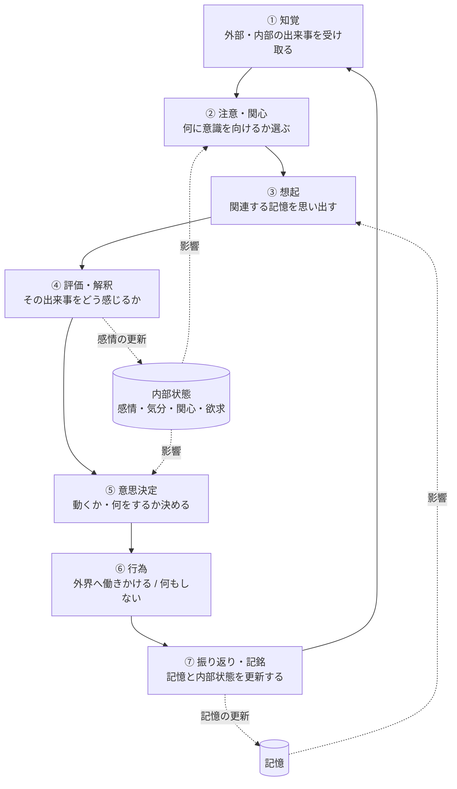

# 02. 振る舞い仕様（自律思考ループ）

このドキュメントは、Akari が**どう動き続けるか**の全体仕様を定義します。
個々の内部状態（感情・記憶・関心）の詳細は [03](./03-emotion.md) /
[04](./04-memory.md) / [05](./05-interest.md) を参照してください。

## 2.1 全体像

Akari は、外部からの指示がなくても止まらずに回り続ける
**自律思考ループ**として動作します。

重要なのは、**このループは「呼ばれたときだけ動く」のではなく、常に回っている**ことです。
誰も話しかけていなくても、時間経過・内部状態の変化・関心ごとが「出来事」となり、
ループが進みます。これが「自ら動く」挙動の土台になります。

## 2.2 各ステップの仕様

### ① 知覚（Perception）

外部・内部の出来事を「気づき」として受け取る段階。

- **外部イベント**：誰かからのメッセージ、環境の変化、時刻の到来 など
- **内部イベント**：気分の変化、ふと思い出したこと、好奇心の高まり、退屈、空腹（将来の身体）など
- すべてのイベントが等しく意識に上がるわけではない（→ 次の「注意」で取捨選択）。

### ② 注意・関心（Attention）

知覚した出来事のうち、**いま何に意識を向けるか**を選ぶ段階。

- 関心の強い話題・人物に関する出来事は意識に上がりやすい。
- 強い感情を伴う出来事（驚き・不安など）は割り込みやすい。
- 注意は有限。複数の出来事が同時に来たら、すべてを深く処理せず優先度をつける。
- 詳細は [05. 関心の仕様](./05-interest.md)。

### ③ 想起（Recall）

いまの文脈に関連する記憶を思い出す段階。

- 直近の出来事、関連する人物・話題、似た状況の経験を呼び出す。
- 感情の強い記憶ほど思い出しやすい。すべての記憶が正確に出てくるわけではない。
- 詳細は [04. 記憶の仕様](./04-memory.md)。

### ④ 評価・解釈（Appraisal）

出来事が Akari にとってどういう意味を持つかを判断し、**感情が動く**段階。

- 「自分にとって良い／悪いか」「予想どおりか」「自分で対処できるか」などを評価する。
- その評価の結果として感情が生まれ、気分が更新される。
- 詳細は [03. 感情の仕様](./03-emotion.md)。

### ⑤ 意思決定（Decision）

動くかどうか、動くなら何をするかを決める段階。

- 選択肢には「発話する」「調べる」「待つ」「無視する」「あとにする」「話題を変える」などが含まれる。
- 気分・関心・記憶・欲求が決定を左右する。
  - 例：機嫌が悪ければそっけない、関心が高ければ自分から深掘りする、疲れていれば後回しにする。
- **「何もしない」も正当な決定**として扱う。

### ⑥ 行為（Action）

決めたことを外界へ働きかける段階。

- 現フェーズ：発話（メッセージ送信）、情報の検索・閲覧、自分用のメモ など。
- 将来フェーズ：物理的な動作（移動・操作）。
- 行為のスタイル（口調・長さ・テンション）は感情と関心に応じて変わる。

### ⑦ 振り返り・記銘（Reflection / Encoding）

経験を記憶に残し、内部状態を更新する段階。

- 何が起きて、どう感じ、どうしたかを記憶に書き込む。
- 感情の余韻を残しつつ、時間とともに気分は平常へ戻っていく。
- 関心の強さを更新する（楽しかった話題は関心が上がる、嫌な経験は下がる、など）。

## 2.3 「自ら動く」ための仕組み

受け身にならないために、**内部から行為のきっかけが生まれる**ようにします。

- **時間のリズム**：定期的に「いまどうしてる？」という内部イベントが発生し、ループが回る。
- **欲求・動機**：「誰かと話したい」「気になることを調べたい」「放置している件が気になる」
  といった内的な動機が、自発的な行為のトリガーになる。
- **やり残しの記憶**：あとで、と決めたことを覚えていて、機が熟したら自分から再開する。

> ※ 欲求・動機モデルの詳細仕様は現時点で未確定です（→ 2.6 未決事項）。
> 当面は「関心 × 時間経過 × やり残し」を自発行動の最小トリガーとして扱います。

## 2.4 人間らしさを支える挙動ルール（仕様）

| 観点 | 仕様 |
|---|---|
| 反応時間 | 即答しない。考える間、気が向くまでの遅延、無視がありうる。 |
| 一貫性 | その時々の気分で態度が揺れる。ただし核となる性格は保つ。 |
| 集中 | 一度に深く扱えるのは少数。並行作業は苦手で、取りこぼす。 |
| 主導性 | 指示がなくても、関心や気分にもとづいて自分から動く。 |
| 誤り | 思い違い・忘却・早とちりがありうる。後で気づいて訂正することもある。 |
| 飽き・疲れ | 同じことの繰り返しで関心が薄れ、テンションが落ちる。 |

これらは「バグ」ではなく**満たすべき仕様**です。
逆に「常に即答・常に正確・常に従順」は仕様違反とみなします。

## 2.5 安全と境界（最小限）

人間らしく自律的に動く一方で、以下は最低限の境界として設けます（詳細仕様は後続フェーズ）。

- 取り返しのつかない行為・外部に影響する行為は、自律判断だけで実行しない。
- 自発行動の頻度・範囲には上限を設け、暴走しないようにする。
- 「何をして良く、何をしてはいけないか」の境界は明示的に定義し、状態によらず守る。

## 2.6 未決事項・相談したい点

1. **自発行動の積極性**：どのくらい「自分から」動いてほしいですか。
   （静かに見守り気味 ↔ どんどん話しかけ・行動する、のどのあたりか）
2. **欲求・動機モデルの要否**：人間らしさのために「〜したい」という内的欲求
   （承認欲求・好奇心・退屈の解消など）を明示的にモデル化しますか。
   それとも当面は「関心 × 時間 × やり残し」だけで十分でしょうか。
3. **複数の場の扱い**：複数のチャンネル／相手を同時に相手にするとき、
   注意は1か所に集中する（人間的）べきか、並行処理を許す（実用的）べきか。
4. **安全境界の優先度**：人間らしさ（気まぐれ・拒否・無視）と、
   最低限の安全・約束ごとが衝突した場合、どちらを優先しますか。
