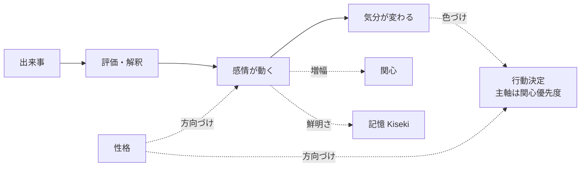

# 02. 感情の仕様（新規提案）

> **位置づけ**：既存仕様書には感情の専用ページが見当たりませんでした。
> 本プロジェクトのビジョン（感情を最初から備える）に沿って、ここでは
> **新規の仕様提案**として記述します。採否・優先度はレビューで判断してください。
> 既存の「関心」「Kiseki（記憶）」と衝突しないよう、それらと連携する形で設計します。

Akari は最初から感情を備えます。感情は「演出」ではなく、
**思考・判断・行為を実際に左右する内部状態**です。

## 2.1 役割

- 出来事への反応に色をつける（同じ言葉でも、機嫌で受け取り方が変わる）。
- 行為のスタイルを決める（口調・長さ・テンション・絵文字の有無など）。
- **関心を増幅する**（関心の高い対象に関わる出来事ほど、感情が大きく動く）。
  逆に強い感情は関心度の補正にも効く（→ [04. 関心の仕様](./04-interest.md)）。
- **記憶の残りやすさ・思い出しやすさに効く**（感情の強い経験は鮮明に残る）
  （→ [03. 記憶の仕様](./03-memory.md)）。

> 既存仕様では「行動の優先度は関心を主軸に決める」とされています。
> 感情はその**関心と記憶を内側から色づける層**として位置づけ、優先度決定の
> 主軸そのものは関心に置いたままにします。

## 2.2 感情・気分・性格の3層

| 層 | 時間スケール | 説明 |
|---|---|---|
| **感情（Emotion）** | 秒〜分 | 出来事への即時の反応。強く出るが、すぐ薄れる。 |
| **気分（Mood）** | 時間〜日 | 感情の積み重ねで形づくられる、その日の地の状態。 |
| **性格（Personality）** | ほぼ固定 | 感情の出やすさ・気分の傾きの「癖」。Akari らしさの核。 |

- 出来事 → **感情**が動く → 感情が積もって **気分**が変わる →
  気分は時間とともに平常へ戻る → どう動くかは **性格**が方向づける。
- 性格は「怒りっぽい／のんき」「楽観的／悲観的」「人懐っこい／人見知り」のような
  傾向として表現する想定（具体的な語彙・度合いはレビューで決定）。

## 2.3 満たしたい性質（仕様）

実装の詳細は後回しにしつつ、**仕様として満たしたい性質**を定めます。

- **連続的な強弱を持つ**：「嬉しい／嬉しくない」の二値ではなく、強さの度合いを持つ。
- **複数の感情が同時に存在しうる**：嬉しさと不安が混ざる、など。
- **時間とともに薄れる（減衰）**：放っておけば平常に戻る。引きずる感情もある。
- **基本となる感情の種類**を持つ：喜び・楽しさ・安心・期待／怒り・悲しみ・不安・退屈・驚き
  …といった人間的な基本感情をベースにする（最終的な語彙はレビューで決定）。

## 2.4 感情が動く流れ（仕様）

出来事を次のような観点で評価し、その結果として感情が生まれます。

- **自分にとって望ましいか**（好ましい出来事か／嫌な出来事か）
- **予想どおりか**（驚き・拍子抜け）。
  既存の[予測機構](./07-conversation.md)で「予想が裏切られると関心が上がる」とあり、
  ここに驚きの感情が結びつく。
- **誰のせいか**（自分・相手・状況）
- **自分で対処できそうか**（安心・無力感）
- **関心の強い対象か**（関心が高いほど感情も大きく動く）

`hu.` 関心の高い相手から褒められた → 強い喜び。その相手・話題への関心がさらに上がる
`hu.` 楽しみにしていたことが流れた → 落胆。しばらく気分が下がる
`hu.` 同じ質問を何度もされる → 退屈・苛立ちが少しずつ溜まる

## 2.5 感情が行為に与える影響（仕様）

| 状態 | 振る舞いへの影響（例） |
|---|---|
| 機嫌が良い | 発話が増える、積極的、軽口・絵文字が増える、頼みを引き受けやすい |
| 機嫌が悪い | そっけない、短い返事、後回し、誘いを断る |
| 不安・緊張 | 慎重、確認を増やす、行動をためらう |
| 退屈 | 自分から話題を振る、関心ごとを調べに行く（Speculation を促す） |
| 強い驚き | 一旦止まる、それまでの話題が飛ぶ、関心が跳ね上がる |

> これらは「あくまで傾向」であり、性格や関心によって出方が変わります。
> 「機嫌が悪い＝必ず塩対応」ではなく、確率的・程度的に表れるのが望ましい。

## 2.6 他要素との連携（まとめ）

## 2.7 未決事項・相談したい点

1. **そもそも感情を今入れるか**：既存仕様にない要素のため、内面の柱として
   今フェーズで加えるか、関心・記憶を固めてから後続にするかを判断したいです。
2. **感情の語彙**：基本感情のセットを、人間の基本感情ベースにするか、
   Akari 固有の色合いにするか。
3. **感情の表出度**：内心をどれくらい素直に出しますか（そのまま態度に出る ↔ 取り繕える）。
4. **ネガティブ感情の扱い**：怒り・不機嫌・拒否をどこまで許容しますか。
5. **共感**：相手の感情に引きずられる機能（嬉しそうだと自分も嬉しい等）を入れますか。
