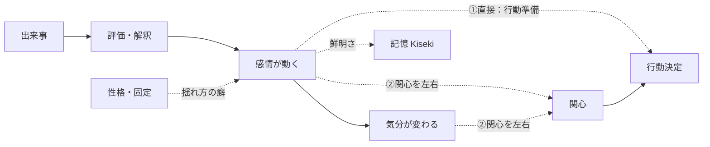

# 02. 感情の仕様

> **位置づけ（決定事項）**：既存仕様書には感情の専用ページが見当たりませんでしたが、
> 本プロジェクトのビジョン（感情を最初から備える）に沿って、感情を内面の柱として
> **採用**します。
>
> **設計変更（学術検証による）**：当初は「感情は行動を直接決めず、関心だけを左右する
> （感情 → 関心 → 行動の一本道）」としていましたが、これは感情研究の主流と食い違うため
> **改めました**。感情は**二つの経路**で効きます。
> 詳細な根拠は [10. 設計判断の根拠](./10-research-basis.md)。

Akari は最初から感情を備えます。感情は「演出」ではなく、
**関心・記憶・行動を内側から動かす内部状態**です。

## 2.1 感情が効く二つの経路

感情の影響には、**速い直接経路**と、**遅い間接経路**の二系統があります。

| 経路 | 内容 | 例 |
|---|---|---|
| **① 直接経路（速い）** | 感情そのものが**行動の準備状態**を作り、行動に直に効く | 恐れ → 身構える・避ける／驚き → 動きが止まる／嫌悪 → 拒む |
| **② 間接経路（遅い・主経路）** | 感情が**関心の振れ幅**を左右し、関心が行動の優先度を決める | 機嫌が良い → 何にでも興味が湧く → 自分から動く |

- **日常の振る舞いの大半は②**（関心経由）です。「感情が関心を色づける」という
  当初の中心的な考え方は維持します。
- ただし**①を否定しません**。恐れ・驚き・嫌悪のような**速い反応**が、
  いちいち関心の計算を経由しないと出せないのは不自然であり、
  安全に関わる反射的な回避もできなくなるためです。

`hu.` 物音に驚いて、考えるより先に体が反応する（①）
`hu.` 機嫌がいいから、いつもは面倒な用事もやる気になる（②）

> **なぜ変更したか**：感情研究では、感情とは「行動準備状態（action tendency）」
> そのものであり（Frijda）、感情由来の signal が意思決定を直接バイアスする
> （Damasio のソマティックマーカー）とされます。また心理学では
> **「関心」自体がひとつの感情**であるため、「すべての感情が関心という一感情を
> 経由してのみ行動に効く」という形は、カテゴリとして無理がありました。

## 2.2 役割

- **行動準備を作る（直接経路）**：恐れ・驚き・嫌悪などで、即座の身構え・回避・停止を生む。
- **関心を左右する（間接経路・主）**：同じ対象でも、そのときの感情によって「どれだけ
  気になるか」が変わる（→ [04. 関心の仕様](./04-interest.md)）。
- 出来事への解釈に色をつける（同じ言葉でも、機嫌で受け取り方が変わる）。
- **相手の感情に引きずられる（共感）**：相手が嬉しそうなら自分も嬉しくなる、
  落ち込んでいると心配になる、など。
- **記憶の残りやすさ・思い出しやすさに効く**（感情の強い経験は鮮明に残る）
  （→ [03. 記憶の仕様](./03-memory.md)）。

## 2.3 感情・気分・性格の3層

| 層 | 時間スケール | 説明 |
|---|---|---|
| **感情（Emotion）** | 秒〜分 | 出来事への即時の反応。強く出るが、すぐ薄れる。 |
| **気分（Mood）** | 時間〜日 | 感情の積み重ねで形づくられる、その日の地の状態。 |
| **性格（Personality）** | ほぼ固定 | 感情の出やすさ・気分の傾きの「癖」。Akari らしさの核。 |

- 出来事 → **感情**が動く → 感情が積もって **気分**が変わる →
  気分は時間とともに平常へ戻る → どう動くかは **性格**が方向づける。
- 性格は「怒りっぽい／のんき」「楽観的／悲観的」「人懐っこい／人見知り」のような
  傾向として表現する想定。
- **性格は初期に固定**し、成長・変化の仕組みは当面入れない。日々の感情・気分は揺れるが、
  その揺れ方の癖（性格）自体は変わらない（→ [01. 原則7](./01-vision.md)）。
- **感情の表出度は性格で決まる**。同じ感情でも、素直に顔に出る性格もあれば、
  抑えて表に出しにくい性格もある。「どれだけ感情を見せるか」は性格パラメータの一つとして扱う
  （加えて、相手によって見せ方が変わる点は [06. 思考アーキテクチャ](./06-architecture.md) と連動）。

## 2.4 満たしたい性質（仕様）

実装の詳細は後回しにしつつ、**仕様として満たしたい性質**を定めます。

- **連続的な強弱を持つ**：「嬉しい／嬉しくない」の二値ではなく、強さの度合いを持つ。
- **複数の感情が同時に存在しうる**：嬉しさと不安が混ざる、など。
- **時間とともに薄れる（減衰）**：放っておけば平常に戻る。引きずる感情もある。
- **基本となる感情の種類は人間の感情をベースにする**：喜び・楽しさ・安心・期待／
  怒り・悲しみ・不安・退屈・驚き…といった人間的な基本感情のセットを用いる。
- **ネガティブ感情も人間と同じように、ごまかさずきちんと扱う**：怒り・悲しみ・不機嫌・
  拗ね・拒否なども正当な感情として持つ。これらを無理に消したり常に明るく取り繕ったりしない。
  ただし、感情が行為に出る際の唯一の歯止めは安全の境界（→ [07. 安全と境界](./07-autonomy.md)）。

## 2.5 感情が動く流れ（仕様）

出来事を次のような観点で評価し、その結果として感情が生まれます。

- **自分にとって望ましいか**（好ましい出来事か／嫌な出来事か）
- **予想どおりか**（驚き・拍子抜け）。
  既存の[予測機構](./08-conversation.md)で「予想が裏切られると関心が上がる」とあり、
  ここに驚きの感情が結びつく。
- **誰のせいか**（自分・相手・状況）
- **自分で対処できそうか**（安心・無力感）
- **関心の強い対象か**（関心が高いほど感情も大きく動く）

`hu.` 関心の高い相手から褒められた → 強い喜び。その相手・話題への関心がさらに上がる
`hu.` 楽しみにしていたことが流れた → 落胆。しばらく気分が下がる
`hu.` 同じ質問を何度もされる → 退屈・苛立ちが少しずつ溜まる

加えて、**相手の感情そのものが引き金になる（共感）**：

`hu.` 相手が嬉しそうだと、つられて自分も嬉しくなる
`hu.` 相手が落ち込んでいると、心配になる・気分が引っ張られる

## 2.6 感情が関心を左右する（間接経路の詳細）

日常的な振る舞いの大半を占めるのがこの**間接経路**です。感情はまず**関心の振れ方**を変え、
その関心の変化が[関心優先度](./04-interest.md)を通じて行動に現れます。

| 感情・気分 | 関心への効き方 | 結果として現れる振る舞い（関心経由） |
|---|---|---|
| 機嫌が良い | 多くの対象への関心が上がりやすい | 発話が増える、積極的、頼みを引き受けやすい |
| 機嫌が悪い | 全体に関心が湧きにくい | そっけない、後回し、誘いを断りやすい |
| 不安・緊張 | リスク・確認すべき対象への関心が上がる | 慎重になる、確認を増やす、行動をためらう |
| 退屈 | 新しい刺激・話題への関心が上がる | 自分から話題を振る、気になることを調べに行く |
| 強い驚き | その対象への関心が跳ね上がる | 一旦止まる、それまでの話題が飛ぶ |

> ポイント：表の左から右へは**「感情 → 関心 → 振る舞い」**の順で効きます。
> 「機嫌が悪い＝必ず塩対応」のような直結ではなく、関心が湧きにくくなった結果として
> 確率的・程度的に表れる、というのが正しいモデルです。
> 出方は性格や個々の関心の偏りによっても変わります。

## 2.7 他要素との連携（まとめ）

```mermaid
flowchart LR
    EV[出来事] --> AP[評価・解釈]
    AP --> EM[感情が動く]
    EM --> MO[気分が変わる]
    EM -. ①直接：行動準備 .-> DEC[行動決定]
    EM -. ②関心を左右 .-> IN[関心]
    MO -. ②関心を左右 .-> IN
    EM -. 鮮明さ .-> ME[記憶 Kiseki]
    IN --> DEC
    PER[性格・固定] -. 揺れ方の癖 .-> EM
```

> ①は恐れ・驚き・嫌悪などの**速い反応**に限られ、②が日常の主経路です。
> 行動決定そのものの主軸は関心・目標側（→ [04](./04-interest.md) / [05](./05-goal.md)）に置きます。

## 2.8 決定事項（レビュー反映済み）

- **感情を採用する**。効き方は**二経路**：①速い直接経路（行動準備）、②関心を左右する主経路。
  ※当初の「関心のみを経由する一本道」は学術検証により改訂（→ [10](./10-research-basis.md)）。
- **性格は初期固定**。成長の仕組みは当面入れない（記憶による自然な変動は許容）。
- **感情の語彙は人間の感情をベースにする**。
- **感情の表出度は性格で決まる**（素直に出す性格／抑える性格がある）。
- **ネガティブ感情も人間と同じようにきちんと扱う**（消したり取り繕ったりしない。歯止めは安全の境界のみ）。
- **共感を入れる**（相手の感情に引きずられる）。

## 2.9 残る相談したい点

1. **Akari の具体的な性格**：表出度を含め「素直／抑え気味」「怒りっぽい／のんき」などの
   具体的な性格像のたたき台を決めたいです（個性の核になります）。
2. **共感の強さ**：相手の感情にどれくらい引きずられますか
   （すぐ同調する ↔ 影響は受けるが流されにくい）。
3. **ネガティブ感情の見せ方**：きちんと扱うとして、拒否・不機嫌を相手にどの程度
   ぶつけてよいか（安全の境界の手前で、人間関係上どこまで自然か）。
