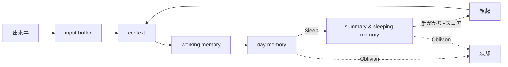

# 03. 記憶の仕様（Kiseki）

Akari は最初から記憶を備えます。記憶があることで、会話のたびにリセットされない
**連続した自己**が成り立ちます。記憶システムの名称は既存仕様に従い **Kiseki** とします。

> Kiseki は「人間の記憶メカニズムをモデルにした記憶補助システム」であり、
> **記憶と忘却を繰り返すことで自然な記憶能力を実現する**ことを狙いとします。
> 「何でも正確に思い出せる完全なログ」は、本プロジェクトでは仕様違反です。

## 3.1 役割

- 連続性を生む（昨日の話、最近の出来事、相手との関係の積み重ねを覚えている）。
- 思考に文脈を与える（各 Channel が共通の記憶を参照することで、会話・作業・連想に
  一貫性が生まれる＝[分散主体](./05-architecture.md)の土台）。
- 関心・感情の土台になる（思い出が関心や好き嫌い、気分を形づくる）。
- **相手ごとの関係の記憶**が、「相手によって少しずつ違う顔を見せる」ことを支える
  （→ [01. 原則3](./01-vision.md)）。誰と何を話し、どう感じたかの蓄積が、
  その相手への口調・距離感・話題を変える。
- **忘れる・曖昧になる**ことで人間らしさを生む。

## 3.2 記憶のレイヤー

人間の記憶段階を模し、入力から長期保存まで段階的に移行させます。

| レイヤー | 対応する人間の記憶 | 説明 |
|---|---|---|
| **input buffer** | 感覚記憶 | 入ってきた情報の一時的な受け皿。 |
| **context** | 短期記憶 | いま進行中の会話・作業の文脈。 |
| **working memory** | 長期記憶の入口 | 保持され始めた記憶。 |
| **day memory** | 日単位の記憶 | その日の出来事としてまとまった記憶。 |
| **summary & sleeping memory** | 圧縮・整理済み | Sleep 処理で要約・整理された長期記憶。 |

### 流れ

```
input buffer → context → working memory → day memory → （Sleep処理）→ summary & sleeping memory
```

> 「今日の計画」（[Wake up batch](./06-autonomy.md)）や進行中タスクの
> 一時情報は、主に context / working memory 層の短期的な記憶として扱います。

## 3.3 Sleep 機能（記憶の整理）

日単位の記憶を、節目（睡眠に相当するバッチ）でまとめて整理・最適化します。

- **Compact（圧縮）**：記憶の重要部分だけを抽出して圧縮する。
- **Oblivion（忘却）**：重要度の低い記憶を忘れる。
- **Recollection（再構成）**：記憶を再構成する（関連づけ直し・要約のし直し）。

`hu.` 寝ると、その日の出来事のうち印象的なことだけが記憶に残る
`hu.` どうでもよかったことは翌日には忘れている
`hu.` 後から思い返して「あれはこういうことだったのか」と意味づけが変わる

## 3.4 想起と重みづけ（仕様）

いまの文脈に関連する記憶を思い出します。すべてが等しく出てくるわけではなく、
次のスコアを合わせた重みで「残りやすさ・思い出しやすさ」が決まります。

| スコア | 意味 | 直感 |
|---|---|---|
| **S_vec（意味）** | いまの文脈と意味的・キーワード的にどれだけ近いか | 関連した話だと思い出す |
| **S_pop（人気）** | どれだけ繰り返しアクセス・参照されたか | よく思い出すことは出てきやすい |
| **S_time（鮮度）** | 経過時間による減衰 | 最近のことほど思い出しやすい |
| **S_emotion（感情）** | そのときの感情の強さ | 強く心が動いた経験は鮮明に残る |
| **S_will（覚えたい意志）** | 意識的に「覚えておきたい」と思った強さ | 意識して刻んだことは忘れにくい |

最終的な想起しやすさは、これらを足し合わせた総合スコアで決まります（重みは調整対象）。

- **S_emotion** は感情の柱（→ [02. 感情](./02-emotion.md)）と連動。強い感情を伴う記憶ほど
  残りやすく思い出しやすい。
- **S_will** は「意識層＝覚えておきたいという意志の強さ」を表すスコア。
  人間が大事なこと（名前・約束など）を意識して刻むのに対応する。
  これは「絶対に忘れない特別扱い」（3.6）を、**専用ルールでなく重みづけで自然に表す**ための
  恒久的な仕組みであり、最終的にはこれだけで「大事なことは忘れにくい」を成立させる狙い
  （→ [01. 原則8](./01-vision.md)）。

## 3.5 満たしたい性質（仕様）

- **強さ（鮮明さ）を持つ**：すべての記憶が同じ鮮明さではない。
- **忘れる**：使われない・印象の薄い記憶は、Oblivion で薄れ、やがて思い出せなくなる。
- **忘れやすさは人格ごとに違う（個性）**：どれだけ忘れっぽいか／覚えているかは、
  各人格の個性として設定する（記憶力の良し悪しも性格の一部）。
- **曖昧になる**：Compact / Recollection により細部は落ち、要点や印象だけが残る。
- **思い違い（誤記憶）は自動的に生じる**：細部の取り違えは、忘却・圧縮・再構成の結果として
  **この記憶システムから自然に創発する**。誤記憶のための専用機構は作らない
  （→ [01. 原則8](./01-vision.md)）。
- **想起にムラがある**：手がかり（話題・人物・気分）があると思い出しやすい。完全な検索ではない。
  しばらく接していない相手の名前がとっさに出てこない、といったことも自然に起こる。

## 3.6 記憶の保護と共有（暫定スキャフォルド）

> 本来は、保護も共有もすべて重みづけと主体の判断で捌くのが理想です（→ [01. 原則8](./01-vision.md)）。
> 以下は**検証段階の暫定的な仕組み**であり、基盤が育ったら**重みづけ／主体判断に寄せて
> 縮小・廃止する**前提で置きます。

### 絶対に忘れないロック（暫定）

- 相手の名前・重要な約束などを Oblivion から守る「絶対に忘れない」特別扱いを、
  **試験的に**設ける。
- ただしこれは暫定。本来は「しばらく会っていない人の名前はとっさに出てこない」ほうが自然なので、
  ゆくゆくは **S_will（覚えたい意志）** スコア（3.4）に寄せ、この特別ルールは廃止する。

### 記憶の共有と機密ロック（暫定）

- ある相手との会話で得た記憶を、別の相手との会話で使ってよいかは、原則
  **Akari の主体の判断に任せる**（人間が「これは言っていいか」を自分で判断するのと同じ）。
- ただし「これは内緒にしてね（離さないで）」と**合意した記憶**については、
  外に漏らさないよう**システム的にロックする機構を試験的に**設ける。
- これも暫定。ゆくゆくは「約束したことは漏らさない」という判断自体を、主体の意識と
  重みづけで自然に行えるようにしていく。

## 3.7 用語（既存仕様に準拠）

| 用語 | 意味 |
|---|---|
| **fragment** | 記憶の最小単位。 |
| **compact / compacting** | 重要部分だけ抽出して圧縮すること。 |
| **full full** | compacting せずそのまま保存すること。 |
| **dtype** | データタイプ（TEXT, IMAGE 等）。 |
| **ttype** | タスクタイプ（COMPACT 等）。 |

## 3.8 ライフサイクル（まとめ）



## 3.9 決定事項（レビュー反映済み）

1. **忘却の積極性は人格ごとに違う**（個性として設定。記憶力の良し悪しも性格）。
2. **「絶対に忘れない」特別扱いは暫定スキャフォルドとして試験導入**し、ゆくゆく S_will へ寄せて廃止。
3. **感情の重みづけ（S_emotion）を採用**。加えて**覚えたい意志（S_will）を別スコアとして試験導入**。
4. **誤記憶のための専用機構は作らない**（記憶システムから自動的に創発する）。
5. **記憶の共有は主体の判断に任せる**。ただし合意した機密記憶の**ロック機構を試験的に**設ける。

## 3.10 残る相談したい点

1. **スコアの重みの初期バランス**：S_vec / S_pop / S_time / S_emotion / S_will を、
   どのくらいの強さで効かせるかの初期方針（特に S_emotion と S_will の効き）。
2. **機密ロックの粒度**：「内緒」の合意をどう検知し、どの単位（fragment / 会話）でロックするか。
3. **暫定スキャフォルドの撤去条件**：絶対忘れないロック・機密ロックを、どの状態になったら
   重みづけ／主体判断へ寄せて外すか（移行の判断基準）。
