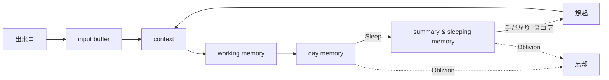

# 03. 記憶の仕様（Kiseki）

Akari は最初から記憶を備えます。記憶があることで、会話のたびにリセットされない
**連続した自己**が成り立ちます。記憶システムの名称は既存仕様に従い **Kiseki** とします。

> Kiseki は「人間の記憶メカニズムをモデルにした記憶補助システム」であり、
> **記憶と忘却を繰り返すことで自然な記憶能力を実現する**ことを狙いとします。
> 「何でも正確に思い出せる完全なログ」は、本プロジェクトでは仕様違反です。

## 3.1 役割

- 連続性を生む（昨日の話、最近の出来事、相手との関係の積み重ねを覚えている）。
- 思考に文脈を与える（各 Channel が共通の記憶を参照することで、会話・作業・連想に
  一貫性が生まれる＝[分散主体](./05-architecture.md)の土台）。
- 関心・感情の土台になる（思い出が関心や好き嫌い、気分を形づくる）。
- **相手ごとの関係の記憶**が、「相手によって少しずつ違う顔を見せる」ことを支える
  （→ [01. 原則3](./01-vision.md)）。誰と何を話し、どう感じたかの蓄積が、
  その相手への口調・距離感・話題を変える。
- **忘れる・曖昧になる**ことで人間らしさを生む。

## 3.2 記憶のレイヤー

人間の記憶段階を模し、入力から長期保存まで段階的に移行させます。

| レイヤー | 対応する人間の記憶 | 説明 |
|---|---|---|
| **input buffer** | 感覚記憶 | 入ってきた情報の一時的な受け皿。 |
| **context** | 短期記憶 | いま進行中の会話・作業の文脈。 |
| **working memory** | 長期記憶の入口 | 保持され始めた記憶。 |
| **day memory** | 日単位の記憶 | その日の出来事としてまとまった記憶。 |
| **summary & sleeping memory** | 圧縮・整理済み | Sleep 処理で要約・整理された長期記憶。 |

### 流れ

```
input buffer → context → working memory → day memory → （Sleep処理）→ summary & sleeping memory
```

> 「今日の計画」（[Wake up batch](./06-autonomy.md)）や進行中タスクの
> 一時情報は、主に context / working memory 層の短期的な記憶として扱います。

## 3.3 Sleep 機能（記憶の整理）

日単位の記憶を、節目（睡眠に相当するバッチ）でまとめて整理・最適化します。

- **Compact（圧縮）**：記憶の重要部分だけを抽出して圧縮する。
- **Oblivion（忘却）**：重要度の低い記憶を忘れる。
- **Recollection（再構成）**：記憶を再構成する（関連づけ直し・要約のし直し）。

`hu.` 寝ると、その日の出来事のうち印象的なことだけが記憶に残る
`hu.` どうでもよかったことは翌日には忘れている
`hu.` 後から思い返して「あれはこういうことだったのか」と意味づけが変わる

## 3.4 想起と重みづけ（仕様）

いまの文脈に関連する記憶を思い出します。すべてが等しく出てくるわけではなく、
次の3つの観点を合わせた重みで「思い出しやすさ」が決まります。

| スコア | 意味 | 直感 |
|---|---|---|
| **S_vec（意味）** | いまの文脈と意味的・キーワード的にどれだけ近いか | 関連した話だと思い出す |
| **S_pop（人気）** | どれだけ繰り返しアクセス・参照されたか | よく思い出すことは出てきやすい |
| **S_time（鮮度）** | 経過時間による減衰 | 最近のことほど思い出しやすい |

最終的な想起しやすさは、これらを足し合わせた総合スコアで決まります（重みは調整対象）。

> 感情の強い記憶ほど残りやすく思い出しやすい、という性質（→ [02. 感情](./02-emotion.md)）も
> ここに効かせたい要素です（感情を S_pop/S_time とは別の重みとして加える案。要レビュー）。

## 3.5 満たしたい性質（仕様）

- **強さ（鮮明さ）を持つ**：すべての記憶が同じ鮮明さではない。
- **忘れる**：使われない・印象の薄い記憶は、Oblivion で薄れ、やがて思い出せなくなる。
- **曖昧になる**：Compact / Recollection により細部は落ち、要点や印象だけが残る。思い違いも起こりうる。
- **想起にムラがある**：手がかり（話題・人物・気分）があると思い出しやすい。完全な検索ではない。

## 3.6 用語（既存仕様に準拠）

| 用語 | 意味 |
|---|---|
| **fragment** | 記憶の最小単位。 |
| **compact / compacting** | 重要部分だけ抽出して圧縮すること。 |
| **full full** | compacting せずそのまま保存すること。 |
| **dtype** | データタイプ（TEXT, IMAGE 等）。 |
| **ttype** | タスクタイプ（COMPACT 等）。 |

## 3.7 ライフサイクル（まとめ）



## 3.8 未決事項・相談したい点

1. **忘却の積極性**：どれくらい忘れてほしいですか
   （ほとんど忘れない ↔ 印象の薄いことはどんどん忘れる）。
   実用性と人間らしさのバランスを相談したいです。
2. **絶対に忘れないこと**：相手の名前・重要な約束などを Oblivion から守る特別扱いを設けますか。
3. **感情の重みづけ**：3.4 のスコアに「感情の強さ」を独立した重みとして加えてよいですか
   （感情の柱を採用する場合）。
4. **思い違い（誤記憶）の許容度**：Recollection で細部を取り違えて話す挙動を入れますか。
5. **記憶の共有範囲**：ある相手との会話で得た記憶を別の相手との会話で使ってよいか
   （プライバシーの境界）。
