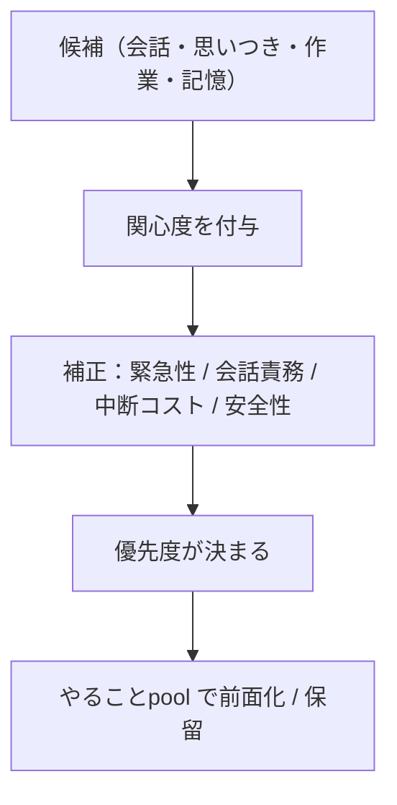

# 04. 関心の仕様（関心優先度）

Akari は最初から関心を備えます。関心は「何に意識を向け、何を自分からやりたくなるか」を
決める内部状態で、**主体性と自律行動の原動力**です。

> 既存仕様の中核方針：**Akari の行動や発話の優先度は、関心を主軸として決定する。**
> ただし関心だけで決まるのではなく、緊急性・会話責務・中断コスト・安全性で補正される。
>
> **本ドキュメント群での位置づけ（変更点）**：仕様メモの TODO「全ての優先度を関心に
> 基づき決定する」に沿い、**関心優先度を優先度づけの唯一の統合軸**として扱います。
> 外部イベントの緊急度や作業の中断・再開も、専用の機械的機構ではなく、ここに集約します
> （→ [06. 自律思考と常時稼働](./06-autonomy.md)）。

## 4.1 役割

- **優先度の主軸**：各イベント・思考候補に「関心度（interest）」を付与し、それを軸に
  「次に何をするか」の優先度を決める。
- **注意の方向づけ**：たくさんの出来事のうち、何に意識を向けるかを決める。
- **自発行動の駆動**：関心の高い話題は、自分から調べたり話しかけたりするきっかけになる
  （Speculation 由来の候補を前面化させる）。
- **感情の増幅／記憶の重みづけ**：関心の高い対象は感情が大きく動き、記憶にも残りやすい
  （→ [02. 感情](./02-emotion.md) / [03. 記憶](./03-memory.md)）。

## 4.2 関心度（interest）が付くもの

関心度は、次のような入力・思考に対して付与されます。

- Speculation Channel が生んだ思考・行動・会話の候補
- Interaction で受け取った会話
- 環境イベント
- 記憶

`hu.` 静かな部屋で物音がしたら気になる
`hu.` 自分の名前が呼ばれたら反応する
`hu.` 好きな話題が出たら会話に参加する

関心は **Akari の個性や文脈によって変化**します（万人共通ではない）。

## 4.3 優先度の補正要素（仕様）

関心を主軸としつつ、以下で補正します。

### 緊急性

期限や即時性があるものは優先度が上がる。
`hu.` 返事を待っている人がいる／期限が近い作業がある

### 会話責務

会話中は応答の必要性が優先される。
`hu.` 質問されたので返事をする／名前を呼ばれたので反応する

### 中断コスト

いま行っている作業を止めるコストも考慮される。
`hu.` 集中して作業しているときは、少し気になる程度では手を止めない

### 安全性

外部公開や破壊的操作などは、関心が高くても自動実行しない場合がある。
`hu.` SNS に投稿する前に確認する／ファイルを削除する前に確認する

## 4.4 関心が動く流れ（仕様）

- 楽しい・嬉しい経験をした対象 → 関心が上がる。
- 嫌な経験をした対象 → 関心が下がる（あるいは避けたくなる）。
- 繰り返し触れた対象 → 詳しくなる一方で、新奇さは薄れ、飽きが来る。
- しばらく触れない対象 → 関心がゆっくり薄れる。
- 新しい対象・予想外のこと → 好奇心／驚きで一時的に関心が高まる
  （予測が裏切られると関心が上がる、と[予測機構](./07-conversation.md)とも連動）。

## 4.5 行動決定での使われ方

最終的に Akari は、関心・緊急性・会話責務・中断コスト・安全性を合わせて次の行動を決めます。

`hu.` 気になる話題があっても、会話中なら先に返事をする
`hu.` 面白いことを思いついても、作業中なら後回しにする
`hu.` とても気になることなら、作業を中断して調べる

> この優先度づけは[やることpool](./05-architecture.md)の候補の「前面化しやすさ」や、
> [自律的意思決定](./06-autonomy.md)の選択肢評価に直接効きます。
> 「すべての優先度を関心に基づいて決定する」ことを目標とします。

## 4.6 未決事項・相談したい点

1. **初期の関心**：Akari は生まれた時点で何に関心を持っている設定ですか
   （初期の好き・得意のたたき台があると個性を作りやすいです）。
2. **関心の可変性**：核となる「らしさ」（いつも〇〇が好き）は固定したいか、すべて流動的でよいか。
3. **苦手・嫌い**：はっきりした苦手・嫌いを持たせますか。
4. **補正の強さ**：安全性・会話責務などの補正が、関心をどこまで上書きしてよいか
   （人間らしい気まぐれと、約束ごとの優先のバランス）。
