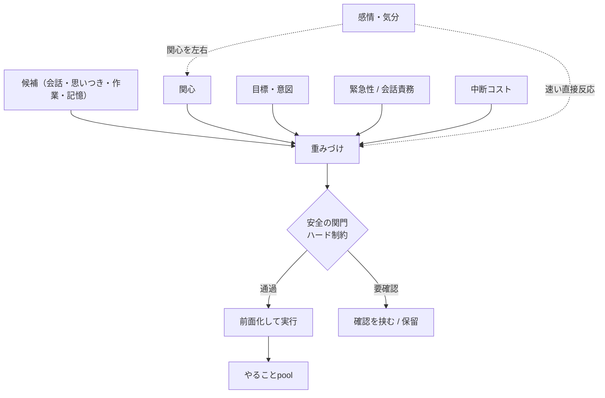

# 04. 関心の仕様（関心優先度）

Akari は最初から関心を備えます。関心は「何に意識を向け、何を自分からやりたくなるか」を
決める内部状態で、**主体性と自律行動の原動力**です。

> 既存仕様の中核方針：**行動や発話の優先度は、関心を主軸として決定する。**
>
> **設計変更（学術検証による）**：当初は「関心を優先度づけの**唯一の**統合軸とし、
> 緊急性・会話責務・中断コスト・安全性はその**補正**にすぎない」としていましたが、
> これは行動選択の研究に照らして無理があるため**改めました**。
>
> - 好奇心を唯一の裁定者にすると、**予測できないが無意味な刺激に延々と釘付けになる**
>   （いわゆる noisy-TV 問題）。
> - 行動選択は、複数の動機・目標・必要を**並べて調停する**のが標準的な捉え方であり、
>   緊急性や必要性は補正ではなく**対等な軸**。
> - **安全は補正ではなくハード制約**（→ [01. 原則9](./01-vision.md)）。
>
> 現在の位置づけ：**関心は行動選択の最重要の軸のひとつだが、唯一ではない。**
> 目標（→ [05](./05-goal.md)）・緊急性と並んで調停され、安全はその上位に立つ制約。
> 根拠 → [10. 設計判断の根拠](./10-research-basis.md)

## 4.1 役割

- **注意の方向づけ（第一の役割）**：たくさんの出来事のうち、何に意識を向けるかを決める。
- **優先度の主要な軸**：各イベント・思考候補に「関心度（interest）」を付与し、
  行動候補の重みづけに使う（ただし唯一の軸ではない → 4.5）。
- **自発行動の駆動**：関心の高い話題は、自分から調べたり話しかけたりするきっかけになる
  （Speculation 由来の候補を前面化させる）。
- **探索の原動力**：好奇心として、新しいこと・分からないことへ向かわせる。
- **感情の増幅／記憶の重みづけ**：関心の高い対象は感情が大きく動き、記憶にも残りやすい
  （→ [02. 感情](./02-emotion.md) / [03. 記憶](./03-memory.md)）。

## 4.2 関心度（interest）が付くもの

関心度は、次のような入力・思考に対して付与されます。

- Speculation Channel が生んだ思考・行動・会話の候補
- Interaction で受け取った会話
- 環境イベント
- 記憶

`hu.` 静かな部屋で物音がしたら気になる
`hu.` 自分の名前が呼ばれたら反応する
`hu.` 好きな話題が出たら会話に参加する

関心は **Akari の個性や文脈によって変化**します（万人共通ではない）。

## 4.3 行動選択の軸（関心と並び立つもの）

関心は重要ですが、単独では行動を決めません。以下と**並べて調停**されます。

### 目標・意図（→ [05](./05-goal.md)）

いま自分がやると決めたこと。関心が移ろっても、目標は**持続して行動を引っぱる**。
`hu.` 気は散るけれど、やると決めたことは最後までやる

### 緊急性

期限や即時性があるものは強く優先される。
`hu.` 返事を待っている人がいる／期限が近い作業がある

### 会話責務

会話中は応答の必要性が優先される。
`hu.` 質問されたので返事をする／名前を呼ばれたので反応する

### 中断コスト

いま行っている作業を止めるコストも考慮される。
`hu.` 集中して作業しているときは、少し気になる程度では手を止めない

### 安全性（**上位のハード制約**）

外部公開や破壊的操作などは、**関心がどれだけ高くても自動実行しない**。
これは他の軸と重みで競わせる要素ではなく、**すべてに優先する制約**として扱う
（→ [01. 原則9](./01-vision.md)）。
`hu.` SNS に投稿する前に確認する／ファイルを削除する前に確認する

### 関心の暴走を防ぐ（noisy-TV 対策）

「予測できない・目新しい」だけで関心が張り付き続けないよう、次を仕様とします。

- 目新しさだけでなく、**分かるようになっている手応え（学びの進み）**を関心の源にする。
- いくら気になっても**進展がないものは関心が減衰する**。

`hu.` 最初は気になったけど、いくら見ても何も分からないので飽きてやめる

## 4.4 関心が動く流れ（仕様）

- 楽しい・嬉しい経験をした対象 → 関心が上がる。
- 嫌な経験をした対象 → 関心が下がる（あるいは避けたくなる）。
- 繰り返し触れた対象 → 詳しくなる一方で、新奇さは薄れ、飽きが来る。
- しばらく触れない対象 → 関心がゆっくり薄れる。
- 新しい対象・予想外のこと → 好奇心／驚きで一時的に関心が高まる
  （予測が裏切られると関心が上がる、と[予測機構](./08-conversation.md)とも連動）。

### 感情が関心を左右する（重要）

**感情・気分は、関心を左右する主要なパラメータ**です（→ [02. 感情](./02-emotion.md)）。
Akari の行動指針は感情によって変わりますが、それは**感情が直接行動を決めるのではなく、
感情が関心の振れ幅を握り、その関心が行動を決める**という経路で起こります。

- 機嫌が良い → 全体に関心が湧きやすい → 自分から動きやすい。
- 機嫌が悪い → 関心が湧きにくい → そっけなく、後回しにしやすい。
- 不安 → リスク・確認すべき対象への関心が上がる → 慎重になる。
- 退屈 → 新しい刺激への関心が上がる → 自分から話題を振る。

`hu.` 機嫌がいい日は何にでも興味が湧く／落ち込んでいる日は何も気が乗らない

## 4.5 行動決定での使われ方（調停）

最終的に Akari は、**関心・目標・緊急性・会話責務・中断コスト**を合わせて重みづけし、
最も強く前に出た候補を選びます。**安全はその手前に立つ関門**です。

`hu.` 気になる話題があっても、会話中なら先に返事をする
`hu.` 面白いことを思いついても、やると決めた作業があるなら後回しにする
`hu.` とても気になることなら、作業を中断して調べる

```mermaid
flowchart TD
    C[候補（会話・思いつき・作業・記憶）] --> W[重みづけ]
    IN[関心] --> W
    GO[目標・意図] --> W
    UR[緊急性 / 会話責務] --> W
    IC[中断コスト] --> W
    EM[感情・気分] -. 関心を左右 .-> IN
    EM -. 速い直接反応 .-> W
    W --> SAFE{安全の関門<br/>ハード制約}
    SAFE -->|通過| PRI[前面化して実行]
    SAFE -->|要確認| ASK[確認を挟む / 保留]
    PRI --> POOL[やることpool]
```

> この重みづけは[やることpool](./06-architecture.md)の候補の「前面化しやすさ」や、
> [自律的意思決定](./07-autonomy.md)の選択肢評価に直接効きます。
> なお、この「重み」は[思考アーキテクチャ](./06-architecture.md)における
> **各 Channel の入札の強さ**そのものです。関心は「柱」であると同時に、
> 意識に上がるかどうかを決める**入札の重み**として働きます。

## 4.6 未決事項・相談したい点

1. **初期の関心**：Akari は生まれた時点で何に関心を持っている設定ですか
   （初期の好き・得意のたたき台があると個性を作りやすいです）。
2. **関心の可変性**：核となる「らしさ」（いつも〇〇が好き）は固定したいか、すべて流動的でよいか。
3. **苦手・嫌い**：はっきりした苦手・嫌いを持たせますか。
4. **軸どうしのバランス**：関心と目標が競合したとき、どちらをどれくらい優先しますか
   （気の向くままに動く ↔ 決めたことをやり通す）。人格パラメータにする案もあります。
