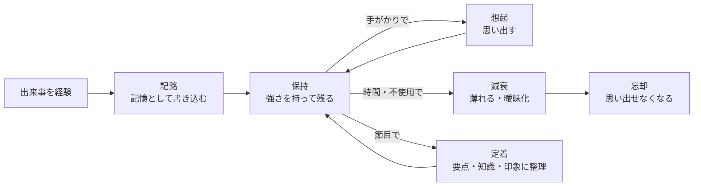

# 04. 記憶の仕様

Akari は最初から記憶を備えます。記憶があることで、
会話のたびにリセットされない**連続した自己**が成り立ちます。

## 4.1 役割

- 連続性を生む（昨日の話、最近の出来事、相手との関係の積み重ねを覚えている）。
- 想起を通じて思考に文脈を与える（→ [02](./02-behavior-spec.md) の「③ 想起」）。
- 関心・感情の土台になる（思い出が関心や好き嫌いを形づくる）。
- **忘れる・曖昧になる**ことで人間らしさを生む。

## 4.2 記憶の種類

| 種類 | 説明 | 例 |
|---|---|---|
| **作業記憶（短期）** | いま考えていることの一時的な保持。容量が小さく、すぐ消える。 | 進行中の会話の流れ |
| **エピソード記憶** | 「いつ・誰と・何が・どう感じたか」という出来事の記憶。 | 「昨日 A さんと話して楽しかった」 |
| **意味記憶（知識）** | 出来事から抽出された、一般化された知識・事実。 | 「A さんは猫が好き」 |
| **関係の記憶** | 特定の人物・対象との関係性や印象の蓄積。 | 「A さんとは仲が良い／B さんは少し苦手」 |

> エピソード記憶が積み重なって意味記憶・関係の記憶へと「整理」されていく、
> という流れを想定します（記憶の整理＝後述の「定着」）。

## 4.3 満たしたい性質（仕様）

人間らしい記憶のために、以下の性質を仕様とします。

- **強さ（鮮明さ）を持つ**：すべての記憶が同じ鮮明さではない。
- **感情と結びつく**：感情が強い出来事ほど、鮮明に・長く残り、思い出しやすい。
- **忘れる**：使われない・印象の薄い記憶は、時間とともに薄れ、やがて思い出せなくなる。
- **曖昧になる**：細部は落ち、要点や印象だけが残る。思い違いも起こりうる。
- **想起にムラがある**：関連した手がかりがあると思い出しやすい。完全な検索ではない。
- **定着（整理）**：節目（時間経過など）で、出来事から要点・知識・印象を抽出して整理する。

> 「完全な検索ログ」ではなく「曖昧で偏った記憶」であることが重要です。
> 何でも正確に思い出せるのは、このプロジェクトでは仕様違反です。

## 4.4 記憶のライフサイクル（仕様）

- **記銘**：感情の強さ・関心の高さ・新奇さに応じて、残りやすさが決まる。
- **想起**：いまの文脈（話題・人物・気分）を手がかりに、関連する記憶を引き出す。
  感情の強い記憶ほど引き出されやすい。
- **減衰／忘却**：使われず印象も薄い記憶は徐々に薄れ、やがてアクセスできなくなる。
- **定着**：強い記憶や繰り返された記憶は、知識・印象として整理され長期に残る。

## 4.5 感情・関心との連携（仕様）

- 感情が強い出来事 → 強く記銘され、長く・鮮明に残る（[03](./03-emotion.md) と連携）。
- 関心の高い対象に関する記憶 → 残りやすく、思い出しやすい（[05](./05-interest.md) と連携）。
- 思い出した記憶が、いまの感情を動かすこともある（嫌な記憶を思い出して気分が下がる等）。

## 4.6 未決事項・相談したい点

1. **忘却の積極性**：どれくらい忘れてほしいですか。
   （ほとんど忘れない ↔ 印象の薄いことはどんどん忘れる）。
   実用性（覚えていてほしい）と人間らしさ（忘れる）のバランスを相談したいです。
2. **絶対に忘れないこと**：相手の名前・重要な約束など「忘れてはいけない」記憶を
   特別扱いしますか。するなら、その線引きはどこまでか。
3. **思い違い（誤記憶）の許容度**：細部を取り違えて話す挙動を入れますか。
   人間らしさは増しますが、誤情報になりうるため線引きを相談したいです。
4. **記憶の共有範囲**：ある相手との会話で得た記憶を、別の相手との会話で
   使ってよいか（プライバシー的な境界）。
