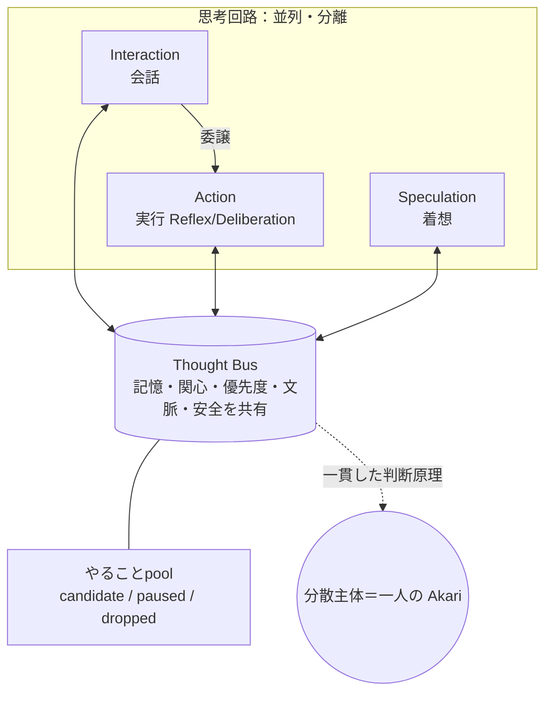

# 05. 思考アーキテクチャ（思考回路と分散主体）

このドキュメントは、Akari が**どういう仕組みで考え、動くか**の全体像を定義します。
（ここでも機能・仕様レベルにとどめ、システム設計は「設計」側に分離します）

## 5.1 根本思想：会話と作業を止め合わない

- 会話が重い作業によってブロックされるのは、体験として致命的。逆も同じ。
- LLM は人間より思考（出力ではない）に時間がかかるため、**並列に思考**させないと
  人間のテンポに追いつけない。
- そこで、主要な思考の系列を**分離して並列に動かす**。

`hu.` 話しながら手を動かす
`hu.` 考えごとをしながら相づちを打つ

## 5.2 思考回路（Channel）

**Channel = 思考の系列**。Channel 間は完全に並列で分離されています。

| Channel | 役割（≒人間の器官） | 責務 | 非責務 |
|---|---|---|---|
| **Interaction Channel** | 言語脳（口） | 対話。意図解釈・応答生成・会話状態の維持。 | 長時間タスクの実行そのもの。 |
| **Action Channel** | 運動脳（手） | 実行のみ。作業を行い結果を返す。発話はしない。 | 口調の最終決定・自発発話の判断。 |
| **Speculation Channel** | 着想・連想 | 待機時間に思考を巡らせ、気づき・提案・次アクション候補を生む。 | 高負荷時は抑制される。 |

### Interaction Channel（会話）

- ユーザー発話の意図を解析し、「その場で返す」か「実行を Action に委譲」かを判定。
- 〇〇調べて、のような小さなタスクでも**実行は Action Channel に委譲**する
  （言語脳と運動脳の分離）。
- Action の進捗・結果を、ユーザーに分かりやすい形へ要約して返す。
- 応答のトーン・粒度・順序を統一し、人格の一貫性を保つ。

### Action Channel（実行）

外部への発話はせず、実行に専念。タスクの大きさで2モードに振り分けます。

| モード | 対象 | 例 | 方針 |
|---|---|---|---|
| **Reflex** | 数秒以内の短時間タスク | 検索、参照、短い変換、軽微な更新 | 高並列・低遅延 |
| **Deliberation** | 複数段階の中長時間タスク | 設計検討、実装、検証、文書作成 | 文脈保持して完了まで継続 |

- 迷う場合は Reflex で着手し、必要に応じて Deliberation へ昇格する。
- **役割分担**：AI は「分類・計画（何を・どの順で）」に専念し、
  **システムが「実行（並列数・リソース管理）」を担う**。
  AI に並列制御まで任せると暴走・ハングのリスクがあるため。

### Speculation Channel（着想）

- 最低優先度で常時動き、取り留めのない思考・連想から候補を生む。
- Interaction / Action が高負荷なときは抑制する。
- 「何もしていない時間」を減らし、自発的な会話・行動の種を作る。

`hu.` 今日は祝日だと気付く → 祝日イベントがあるかもと思う → その話題を会話に出したくなる

## 5.3 分散主体：複数の Channel で「一人」に見せる

複数の Channel を持つが、ユーザーからは**一人の主体**として見える必要があります。

- Akari の主体は、特定の1つの Channel に宿るのではない。
- 各 Channel が **記憶・関心・優先度・現在の文脈・安全性制約を共有**し、
  **同じ判断原理**に従って振る舞うことで、一人の自己が成立する。
- これは「中央司令塔がすべてを逐次裁く」方式ではない。中央集権だと
  人間らしい同時性が失われ、すべてが順次処理に見えてしまうため。

`hu.` 話す自分・考える自分・作業する自分に分かれて見えても、自分は一人
`hu.` 口と手と頭は別の器官だが、判断している主体は一つ

> つまり分散主体とは、各 Channel が**同じ関心の偏り・同じ記憶**を共有している状態。
> 気になることの偏りが、会話にも作業にも共通して現れる。

### 一人だが、相手によって見せる顔は変わる

分散主体は「複数 Channel をまたいで一人」という**内側の一貫性**の話です。
これと、「**相手によって少しずつ見せる姿が変わる**」（→ [01. 原則3](./01-vision.md)）は
両立します。

- 自己（記憶・関心・性格の核）は一人で一貫している。
- 一方で、関係の記憶（→ [03. 記憶](./03-memory.md)）に応じて、相手ごとに口調・距離感・
  話題の出し方が変わる。
- これは多重人格ではなく、人間が相手によって態度を変えるのと同じ。

`hu.` 同じ自分でも、親友と初対面の人とでは話し方が違う

## 5.4 やることpool：未処理の行動候補を束ねる場

各 Channel から生まれる**まだ実行も発話もされていない行動候補**を、共通の場で保持します。

### 入る候補

- 会話への返答候補（Interaction 由来）
- 思いつき候補（Speculation 由来）
- 後でやりたい作業・再開候補・派生タスク（Action 由来）
- 中断して保留に戻った行動

`hu.` 返事しようと思っている／後で調べようと思っている
`hu.` 途中までやったが今は止めている／さっき思いついたことがまだ少し気になっている

### 候補の状態

| 状態 | 意味 |
|---|---|
| **candidate** | まだ未採用の候補 |
| **paused** | 一度着手したが保留に戻った候補 |
| **dropped** | 関心低下などで実質的に消えた候補 |

### 性質

- すぐ実行されるとは限らず、しばらく保持される。
- **関心と文脈に応じて前面化しやすさが変わる**（→ [04. 関心](./04-interest.md)）。
- 関心が低下すると消えやすくなる。
- 単なる固定的なタスクリストではなく、**濃淡が変わる保留層**。

`hu.` 今は返せないが、少し後で返す
`hu.` 少し気になるだけの思いつきは保留のまま残る
`hu.` しばらくするとどうでもよくなって消える

## 5.5 全体像

## 5.6 未決事項・相談したい点

1. **Channel 構成の粒度**：Interaction / Action / Speculation の3系列で過不足ないですか
   （例えば「感情処理」を別系列にするか、各 Channel 内に内包するか）。
2. **並列の同時性の見せ方**：複数 Channel が同時に動いていることを、ユーザーにどこまで
   見せますか（「考え中」「作業中」の可視化の有無）。
3. **やることpool の寿命**：dropped になるまでの保持の長さ・条件をどの程度にしますか。
