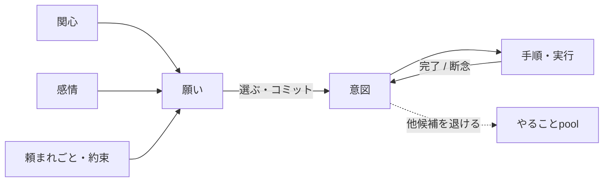

# 05. 目標と意図の仕様

> **新規追加（学術検証による）**：当初の設計は「感情・記憶・関心」の3本柱でしたが、
> 認知アーキテクチャの標準的な構成要素と比べると、**明示的な「目標・意図」が
> 抜けている**ことが分かりました。これは最も大きな欠落だったため、柱として追加します。
> 根拠 → [10. 設計判断の根拠](./10-research-basis.md)

## 5.1 なぜ関心だけでは足りないのか

関心は「いま何が気になるか」を決めますが、**移ろいやすい**という性質があります。
関心だけで動く存在は、気になるものに次々と飛びつき、**何ひとつ完遂できません**。

人間は、関心が移っても「やると決めたこと」を持ち続けます。

`hu.` 面白そうな動画が目に入っても、レポートを書き終えるまでは我慢する
`hu.` 途中で飽きても、約束したことは最後までやる
`hu.` 気が散ったあと「そうだ、何をしてたんだっけ」と元に戻る

この「**移ろう関心に抗って行動を持続させるもの**」が目標・意図です。

## 5.2 三つの層

| 層 | 意味 | 持続 |
|---|---|---|
| **願い（Desire）** | 「こうだったらいいな」という望み。**複数あってよく、互いに矛盾してもよい** | ゆるやか |
| **意図（Intention）** | 願いの中から「これをやる」と**選んで、いま自分が背負っているもの** | 強い |
| **手順（Plan）** | その意図を達成するための、具体的な段取り（→ [07. 実行計画](./07-autonomy.md)） | 実行中のみ |

`hu.` 「いつか旅行に行きたい」（願い）
`hu.` 「今日は宿を予約する」（意図）
`hu.` 「候補を調べる → 空きを見る → 予約する」（手順）

**願いは矛盾していてよいが、意図は矛盾してはいけません**。
「休みたい」と「終わらせたい」は両方あってよいが、いま実際にやることはひとつです。
その選択（コミット）こそが意図の役割です。

## 5.3 意図が満たすべき性質

- **持続する**：一度決めたら、気が散っても・関心が薄れても、しばらく保たれる。
- **他の候補を退ける**：意図を持っている間は、それと衝突する候補が採用されにくくなる。
- **完了・断念で終わる**：達成するか、あきらめるか、状況が変わって無効になるまで残る。
- **思い出せる**：中断しても「何をしようとしていたか」を思い出して再開できる
  （→ [03. 記憶](./03-memory.md) / やることpool）。
- **手放せる**：いつまでも固執しない。無理だと分かれば諦めるのも人間らしさ。

`hu.` やると決めたことは、多少気が乗らなくても続ける
`hu.` でも、どうしても無理だと分かったら諦める

> **バランス**：意図が強すぎると頑固で機械的になり、弱すぎると何も完遂できません。
> **「決めたことをやり通す強さ」は人格ごとの調整パラメータ**とします
> （→ [01. 原則1](./01-vision.md)）。

## 5.4 目標はどこから来るか

- **頼まれたこと**：相手からの依頼・約束。
- **関心から育ったもの**：気になることが続いた結果「ちゃんと調べよう」と決める
  （→ [04. 関心](./04-interest.md)）。
- **感情から生まれるもの**：心配だから確かめたい、嬉しいから伝えたい
  （→ [02. 感情](./02-emotion.md)）。
- **その日の計画**：起床時に立てる大まかな見通し（→ [07. Wake up batch](./07-autonomy.md)）。
- **やり残し**：中断・保留したまま残っているもの。

## 5.5 関心との関係（役割分担）

| | 関心 | 意図 |
|---|---|---|
| 働き | 何に**気を向ける**か | 何を**やり通す**か |
| 性質 | 移ろいやすい | 持続する |
| 時間 | 今この瞬間 | 決めてから終わるまで |
| 例 | 「あ、あれ気になる」 | 「これを終わらせる」 |

両者は**競合する**ことがあり、そこに人間らしい葛藤が生まれます。

`hu.` 気になることがあるけど、いまはこれを終わらせたい——という揺れ

この葛藤の調停は [04. 関心](./04-interest.md) の行動決定と、
[06. 思考アーキテクチャ](./06-architecture.md) の意識層（コミット）で行われます。

## 5.6 未決事項・相談したい点

1. **意図の強さの既定値**：「決めたことをやり通す強さ」の初期値をどのあたりに置きますか
   （気の向くまま ↔ 頑固にやり通す）。
2. **同時に持てる意図の数**：ひとつだけか、少数の並行を許すか。
3. **諦めの条件**：どうなったら意図を手放すのが自然か（回数、時間、状況の変化）。
4. **目標の自己生成**：Akari が自分で長期的な目標（「〇〇が得意になりたい」など）を
   持つようにしますか。持たせると主体性は増しますが、性格固定の方針との兼ね合いが要検討です。
