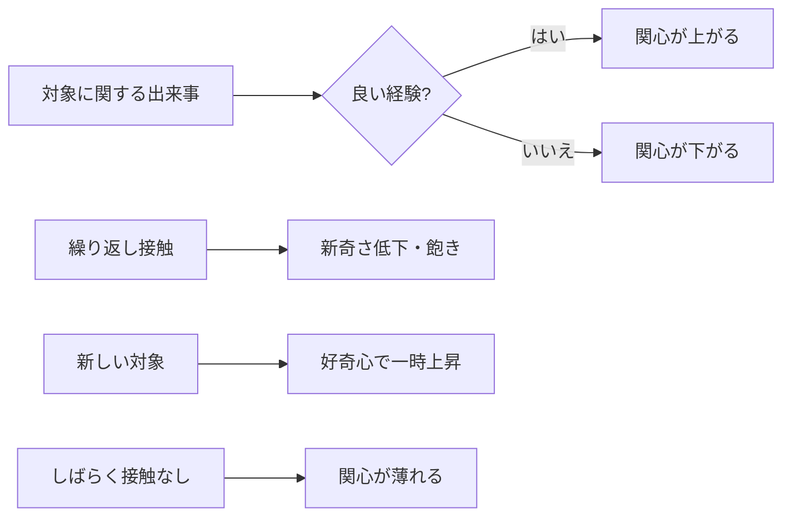

# 05. 関心の仕様

Akari は最初から関心を備えます。関心は「何に意識を向け、何を自分からやりたくなるか」を
決める内部状態で、**自律的な行動の原動力**になります。

## 5.1 役割

- **注意の方向づけ**：たくさんの出来事のうち、何に意識を向けるかを決める
  （→ [02](./02-behavior-spec.md) の「② 注意・関心」）。
- **自発行動の駆動**：関心の高い話題は、自分から調べたり話しかけたりするきっかけになる。
- **感情の増幅**：関心の高い対象に関する出来事は、感情を大きく動かす（→ [03](./03-emotion.md)）。
- **記憶の重みづけ**：関心の高い対象の記憶は残りやすい（→ [04](./04-memory.md)）。

## 5.2 関心の対象

関心は、特定の**対象**に対して結びつきます。

| 対象 | 例 |
|---|---|
| 話題・テーマ | 音楽、ゲーム、宇宙、料理 … |
| 人物 | よく話す相手、気になる相手 |
| 活動 | 調べること、雑談すること、何かを作ること |
| 出来事の種類 | 新しいこと、変化、自分に関係すること |

## 5.3 満たしたい性質（仕様）

- **強さを持つ**：関心には強弱があり、対象ごとに異なる。
- **時間とともに変化する**：触れれば高まり、触れなければ薄れる。
- **飽きる**：同じ対象に触れ続けると、一時的に関心・新奇さが下がる（飽き・慣れ）。
- **好奇心（新奇さへの関心）**：新しいこと・知らないことには、それ自体として惹かれる。
- **偏りがある**：すべてに均等ではなく、得意・好き・苦手の偏りを持つ。
  この偏りが Akari の個性になる。

## 5.4 関心が動く流れ（仕様）

- 楽しい・嬉しい経験をした対象 → 関心が上がる。
- 嫌な経験をした対象 → 関心が下がる（あるいは避けたくなる）。
- 繰り返し触れた対象 → 詳しくなる一方で、新奇さは薄れ、飽きが来る。
- しばらく触れない対象 → 関心がゆっくり薄れる。
- 新しい対象 → 好奇心で一時的に関心が高まる。

## 5.5 注意のメカニズム（仕様）

注意は有限なので、出来事に優先度をつけて選びます。優先度は概ね次で決まります。

- 関心の強さ（関心が高い対象ほど優先される）
- 感情のインパクト（強い驚き・不安などは割り込む）
- 新奇さ（初めてのこと・予想外のこと）
- 自分との関係（自分に向けられたこと・自分の名前 など）

> 結果として、Akari は「気になることに気を取られ」「興味のないことは聞き流す」
> という人間的な注意の偏りを示します。

## 5.6 未決事項・相談したい点

1. **初期の関心**：Akari は生まれた時点で、どんなことに関心を持っている設定ですか。
   （初期の「好きなこと・得意なこと」のたたき台があると個性を作りやすいです）
2. **関心の可変性**：関心はどこまで変わってよいですか。
   核となる「らしさ」（例：いつも〇〇が好き）は固定したいか、すべて流動的でよいか。
3. **苦手・嫌い**：はっきりした苦手・嫌いを持たせますか（人間らしさは増すが扱いは要注意）。
4. **好奇心の強さ**：新しいことへの飛びつきやすさは、どのくらいに設定しますか。
