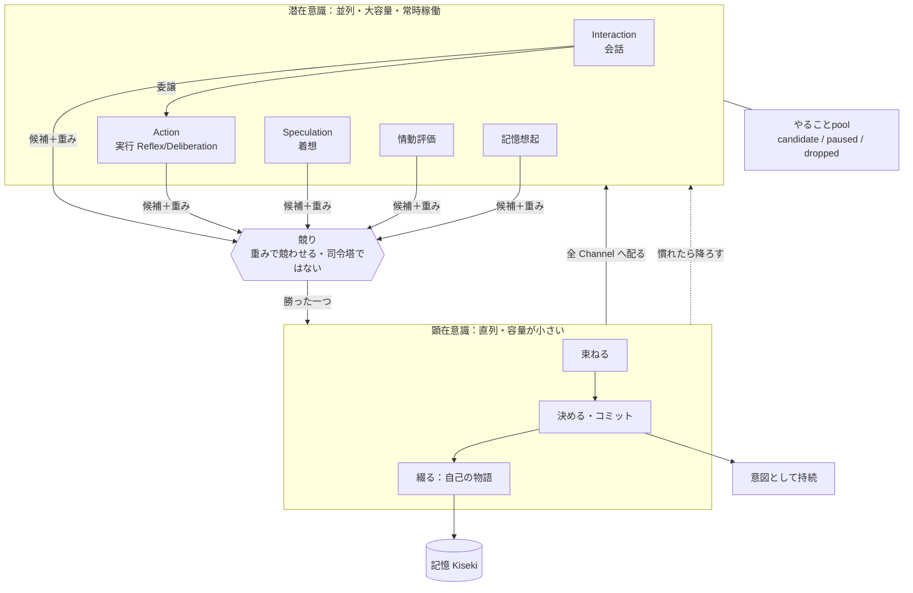

# 06. 思考アーキテクチャ（顕在意識と潜在意識）

このドキュメントは、Akari が**どういう仕組みで考え、動くか**の全体像を定義します。
（ここでも機能・仕様レベルにとどめ、システム設計は「設計」側に分離します）

> **設計変更（学術検証による）**：当初は「主体は複数の Channel に分散し、
> **中央の機構は置かず**、一貫性は共有された記憶・関心だけから生まれる」としていました。
> しかしこれでは、**並列に動く Channel どうしが矛盾したときに誰も裁定できず**、
> 「一人の存在」としてのまとまりが保証されません。
>
> そこで本ドキュメントでは、この構造を **顕在意識（意識層）と潜在意識（無意識層）** として
> 捉え直します。並列に動く Channel 群が**潜在意識**、そこから上がってきたものを
> ひとつに束ねる**直列の意識層**が顕在意識です。
>
> **重要**：これは「中央司令塔を置く」という意味では**ありません**。
> 意識層は物事を決める偉い人ではなく、**競り上がってきたものを一つ選び、全体に配る場**です。
> 賢さはすべて Channel 側にあり、主体は依然として分散しています。
> 根拠 → [10. 設計判断の根拠](./10-research-basis.md)

## 6.1 根本思想：会話と作業を止め合わない

- 会話が重い作業によってブロックされるのは、体験として致命的。逆も同じ。
- LLM は人間より思考（出力ではない）に時間がかかるため、**並列に思考**させないと
  人間のテンポに追いつけない。
- そこで、主要な思考の系列を**分離して並列に動かす**。

`hu.` 話しながら手を動かす
`hu.` 考えごとをしながら相づちを打つ

ただし並列なだけでは「一人」になりません。**並列に考えつつ、一本の意識の流れを持つ**
——この両立が本アーキテクチャの核です。

## 6.2 二層構造：潜在意識と顕在意識

| 層 | 性質 | 中身 |
|---|---|---|
| **潜在意識（無意識層）** | **並列**・大容量・常時稼働・互いに干渉しない | 各 Channel（会話・実行・着想・情動評価・記憶想起） |
| **顕在意識（意識層）** | **直列**・容量が小さい・一度にひとつ | 選ばれた内容の統合・コミット・自己の物語 |

`hu.` 頭の中ではいろんなことが同時に浮かんでいる（潜在意識）
`hu.` けれど「いま意識していること」はひとつだけ（顕在意識）

### なぜ意識層は「狭くて直列」なのか

これは制約ではなく**機能**です。並列の Channel は矛盾した結論を出しえます。
それを**ひとつに絞って全体に配る**からこそ、行動が一貫し、
「一人が考えている」という筋が通ります。

> **仕様上の注意**：意識層が何かを扱っている間、他の Channel の候補は**順番待ち**になります。
> 「同時に二つのことを決めてしまう」ことは起こりません。
> ただし[原則1・5](./01-vision.md)により、**意識層の広さ（同時に扱える数）は
> 人格ごとの調整パラメータ**とします。既定は人間に近く狭いですが、
> 広く設定した人格（多くを並行して意識できる）も仕様として認めます。

## 6.3 思考回路（Channel）＝潜在意識の担い手

**Channel = 思考の系列**。Channel 間は完全に並列で分離されています。

| Channel | 役割（≒人間の器官） | 責務 | 非責務 |
|---|---|---|---|
| **Interaction Channel** | 言語脳（口） | 対話。意図解釈・応答生成・会話状態の維持。 | 長時間タスクの実行そのもの。 |
| **Action Channel** | 運動脳（手） | 実行のみ。作業を行い結果を返す。発話はしない。 | 口調の最終決定・自発発話の判断。 |
| **Speculation Channel** | 着想・連想 | 待機時間に思考を巡らせ、気づき・提案・次アクション候補を生む。 | 高負荷時は抑制される。 |

### Interaction Channel（会話）

- ユーザー発話の意図を解析し、「その場で返す」か「実行を Action に委譲」かを判定。
- 〇〇調べて、のような小さなタスクでも**実行は Action Channel に委譲**する
  （言語脳と運動脳の分離）。
- Action の進捗・結果を、ユーザーに分かりやすい形へ要約して返す。
- 応答のトーン・粒度・順序を統一し、人格の一貫性を保つ。

### Action Channel（実行）

外部への発話はせず、実行に専念。タスクの大きさで2モードに振り分けます。

| モード | 対象 | 例 | 方針 |
|---|---|---|---|
| **Reflex** | 数秒以内の短時間タスク | 検索、参照、短い変換、軽微な更新 | 高並列・低遅延 |
| **Deliberation** | 複数段階の中長時間タスク | 設計検討、実装、検証、文書作成 | 文脈保持して完了まで継続 |

- 迷う場合は Reflex で着手し、必要に応じて Deliberation へ昇格する。
- **役割分担**：AI は「分類・計画（何を・どの順で）」に専念し、
  **システムが「実行（並列数・リソース管理）」を担う**。
  AI に並列制御まで任せると暴走・ハングのリスクがあるため。

### Speculation Channel（着想）

- 最低優先度で常時動き、取り留めのない思考・連想から候補を生む。
- Interaction / Action が高負荷なときは抑制する。
- 「何もしていない時間」を減らし、自発的な会話・行動の種を作る。

`hu.` 今日は祝日だと気付く → 祝日イベントがあるかもと思う → その話題を会話に出したくなる

### そのほかの Channel

- **情動評価**：出来事が自分にとってどうかを絶えず評価し、感情を生む（→ [02. 感情](./02-emotion.md)）。
- **記憶想起**：いまの文脈に関連する記憶を掘り出す（→ [03. 記憶](./03-memory.md)）。

## 6.4 意識層：ひとつに束ねる場

各 Channel は、自分の候補に**「どれだけ強く前に出たいか」という重み**を添えて差し出します。
この重みは[関心](./04-interest.md)・目標・緊急性・感情の強さから決まります。

意識層がすることは、次の**5つだけ**です。**内容を判断するのは Channel の仕事**であり、
意識層は賢い司令塔ではありません。

| # | 働き | 内容 |
|---|---|---|
| 1 | **選ぶ（競り）** | 各 Channel の候補を重みで競わせ、勝ったものを採る。重みが高いほど勝ちやすいが、確定ではない（ゆらぎがある）。 |
| 2 | **配る（共有）** | 選ばれた内容を、**入札しなかった Channel も含めた全体に配る**。これで全員の前提が揃う。 |
| 3 | **束ねる（統合）** | 選ばれた内容といまの文脈を突き合わせ、矛盾があればここで解消する。 |
| 4 | **決める（コミット）** | 「これをやる」と意図として引き受ける（→ [05. 目標と意図](./05-goal.md)）。取り返しのつかない行為は必ずここを通す。 |
| 5 | **綴る（自己の物語）** | 選ばれた内容を順に記録し続ける。**この一本の流れそのものが「一人の自己」**。 |

> 特に **2（配る）** が要です。ただ共有メモリに書いておくだけでは、
> 各 Channel が違う前提のまま勝手に動いてしまいます。
> 「選ばれた」ことを全体に**知らせる**から、全員の足並みが揃います。

`hu.` いろいろ頭に浮かぶが、口に出すのはひとつ。そして口に出すと、自分でも「そう思っていたのか」と分かる

## 6.5 「一人であること」はどこから来るのか

複数の Channel を持ちながら、ユーザーからは**一人の主体**として見える必要があります。
その一貫性は、次の**三つ**から生まれます。

1. **共有**：各 Channel が記憶・関心・性格・安全の制約を共有している（当初からの考え）。
2. **一本の流れ**：意識層で選ばれた内容が**ひとつの順序ある流れ**になっている（今回追加）。
3. **コミット**：意図として引き受けたことが、Channel をまたいで持続する（今回追加）。

`hu.` 話す自分・考える自分・作業する自分に分かれて見えても、自分は一人
`hu.` 口と手と頭は別の器官だが、意識しているのは一つの流れ

> **中央司令塔は依然として置きません。** 意識層は「競りの場と拡声器」であって、
> 中身を決める偉い人ではない。何をどう考えるかは Channel が担い、
> 主体は分散したままです。加わったのは**順番をつける一点**だけです。

### 一人だが、相手によって見せる顔は変わる

上記は「複数 Channel をまたいで一人」という**内側の一貫性**の話です。
これと、「**相手によって少しずつ見せる姿が変わる**」（→ [01. 原則3](./01-vision.md)）は
両立します。

- 自己（記憶・関心・性格の核）は一人で一貫している。
- 一方で、関係の記憶（→ [03. 記憶](./03-memory.md)）に応じて、相手ごとに口調・距離感・
  話題の出し方が変わる。
- これは多重人格ではなく、人間が相手によって態度を変えるのと同じ。

`hu.` 同じ自分でも、親友と初対面の人とでは話し方が違う

## 6.6 慣れ：意識から無意識へ降ろす

同じことを繰り返すうちに、人は考えなくてもできるようになります。
Akari も同じように、**繰り返して安定した振る舞いを、意識層から潜在意識へ降ろします**。

- **初めてのこと・やり方が定まらないことは、意識層を通す**（遅いが確実）。
- **やり方がいつも同じで安定したものは、Channel 側に降ろして自動化**する（速い・並列）。
- **失敗したり驚いたりしたら、意識層に戻す**（うまくいかないので考え直す）。

`hu.` 初めての道は考えながら運転するが、慣れた道は考えずに運転できる
`hu.` でも工事で通行止めだと、また意識して考え始める

> これは Akari が**成長する数少ない仕組み**です。性格は固定（[原則7](./01-vision.md)）ですが、
> 「慣れ」による手際の良さは変わっていきます。

### どちらに置くかの判断基準

| 潜在意識（並列・自動） | 顕在意識（直列・意識的） |
|---|---|
| やり方がいつも同じ | やり方が状況で変わる／初めて |
| 他の Channel と噛み合わせる必要がない | Channel 間で矛盾を解く必要がある |
| 取り消せる・影響が小さい | **取り返しがつかない・外部に影響する** |

## 6.7 やることpool：未処理の行動候補を束ねる場

各 Channel から生まれる**まだ実行も発話もされていない行動候補**を、共通の場で保持します。

### 入る候補

- 会話への返答候補（Interaction 由来）
- 思いつき候補（Speculation 由来）
- 後でやりたい作業・再開候補・派生タスク（Action 由来）
- 中断して保留に戻った行動

`hu.` 返事しようと思っている／後で調べようと思っている
`hu.` 途中までやったが今は止めている／さっき思いついたことがまだ少し気になっている

### 候補の状態

| 状態 | 意味 |
|---|---|
| **candidate** | まだ未採用の候補 |
| **paused** | 一度着手したが保留に戻った候補 |
| **dropped** | 関心低下などで実質的に消えた候補 |

### 性質

- すぐ実行されるとは限らず、しばらく保持される。
- **関心と文脈に応じて前面化しやすさが変わる**（→ [04. 関心](./04-interest.md)）。
- 関心が低下すると消えやすくなる。
- 単なる固定的なタスクリストではなく、**濃淡が変わる保留層**。

`hu.` 今は返せないが、少し後で返す
`hu.` 少し気になるだけの思いつきは保留のまま残る
`hu.` しばらくするとどうでもよくなって消える

## 6.8 全体像

> 図の要点：**賢さは潜在意識（Channel）側にあり、顕在意識は「一つ選んで全体に配る」だけ**。
> それでも、選ばれたものが一本の流れになることで「一人の Akari」が成立します。

## 6.9 未決事項・相談したい点

1. **Channel 構成の粒度**：会話 / 実行 / 着想 / 情動評価 / 記憶想起 で過不足ないですか。
2. **意識層の広さの既定値**：一度に意識できる数を、人間に近く狭く（1つ程度）しますか。
   人格パラメータとして、どの範囲まで開けますか。
3. **並列の同時性の見せ方**：複数 Channel が同時に動いていることを、ユーザーにどこまで
   見せますか（「考え中」「作業中」の可視化の有無）。
4. **やることpool の寿命**：dropped になるまでの保持の長さ・条件をどの程度にしますか。
5. **「慣れ」の導入時期**：意識→無意識への自動化（6.6）を直近で入れますか、後回しにしますか。
