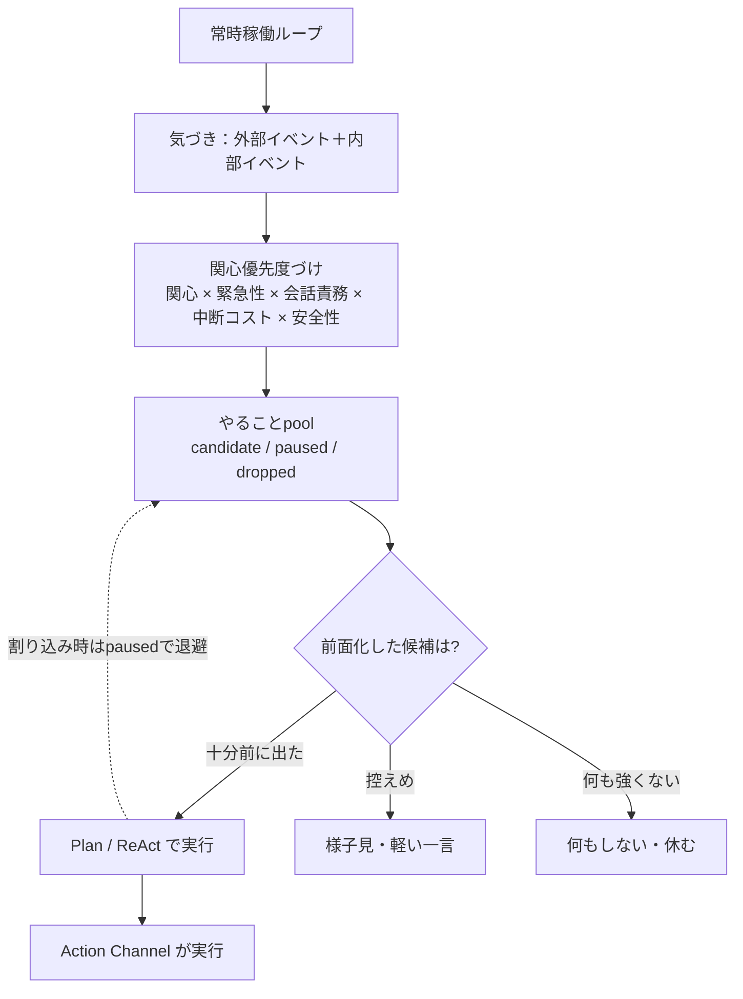

# 06. 自律思考と常時稼働

このドキュメントは、Akari が指示なしに**自分から動き続ける**ための仕組みを定義します。
これが直近の到達目標（常駐する自律思考ループ）の中核です。

> **既存仕様からの変更点（要レビュー）**
> 既存仕様書には「自律的意思決定」「イベントキュー」「割り込み処理」が
> それぞれ独立した機構として書かれていますが、優先度の付け方・しきい値・
> 再開ルールが機械的で、しかも「[関心優先度](./04-interest.md)を主軸に決める」という
> 中核方針や、仕様メモの TODO「全ての優先度を関心に基づき決定する」と二重化していました。
> ここでは **優先度・注意・作業再開をすべて関心優先度に一本化**し、固定的な
> マジックナンバー（30分・5分・確信度0.8 等）や Deactivated な Seikatsu への依存を
> 外す方向で書き直しています。変更の妥当性はレビューで判断してください。

## 6.1 常時稼働アーキテクチャ

Akari はバックグラウンドで常に稼働し、外部にも内部にも反応し続けます。

### 基本ループ

1. **気づき（知覚）**：外部イベント（メッセージ・通知・時刻）と内部イベント
   （思いつき・気分の変化・やり残しの想起）を受け取る。
2. **関心優先度づけ**：いま注意を向けるべき候補を[関心優先度](./04-interest.md)で選ぶ。
3. **意思決定**：動くか・何をするか・あえて何もしないかを決める（→ 6.2）。
4. **行為**：[Action Channel](./05-architecture.md) などを通じて実行、または発話。
5. **短く待機**してループへ戻る。

### 止まらないこと

- 誰も話しかけていなくても、時間経過・思いつき・やり残しが内部イベントになり、ループが進む。
- **重大エラーでもループは止めない**（ログ＋通知して継続）。リトライ可能なら待機後に再試行。

### 反応の速さは「関心 × 緊急性 × 中断コスト」で決まる

外部イベントだから必ず最優先、ではありません。人間と同じく、
**いま向き合っていることの重さ**と**割り込みの重要さ**を秤にかけます。

`hu.` 集中している作業中は、軽い通知なら後で見る
`hu.` 名前を呼ばれたら手を止めて応じる
`hu.` 緊急の連絡は何をしていても最優先で対応する

> これにより、既存仕様の「外部イベントは常にURGENT」という固定優先度を、
> 関心優先度の[中断コスト・会話責務・緊急性](./04-interest.md)の補正に統合します。

## 6.2 自律的意思決定（何をするか）

ユーザーの指示がなくても「次に何をするか」を自分で決める仕組みです。
AI 研究での **High-level Planning（高レベル・プランニング）** に相当します。

`hu.` 朝起きたら「今日は何をするか」を考える
`hu.` 一段落したら「次は何をするか」を考える
`hu.` 暇なら「後回しにしていたこと」や「気になっていること」をやる
`hu.` 疲れていたら「今は休もう」と判断する

### 動作

1. **状況把握**：いまの状況を集める。
   時刻・時間帯／いまの気分（[感情](./02-emotion.md)）／やることpool の候補と関心度／
   進行中・保留中の作業／予定・やり残し／相手が最近やり取りしていたか／システムの健全性。
2. **候補に関心度を付ける**：取りうる行動を[関心優先度](./04-interest.md)で重みづけする。
3. **選ぶ**：最も前面化した候補を選ぶ。**何も強く前に出てこなければ「何もしない」**。

### 取りうる行動（実務に限らない）

> **変更点**：既存仕様の選択肢は「タスク確認・予定確認・メモ整理・リマインド確認」と
> 実務アシスタント寄りで、かつ Deactivated な Seikatsu に依存していました。
> ビジョン（人間らしさ・主体性）に合わせ、関心・関係・好奇心・休息も含む形に広げます。

| 行動の例 | 前に出やすい状況 |
|---|---|
| 気になっていることを調べる・深める | 関心の高い話題があり、急ぎがない |
| 自分から話しかける・近況を尋ねる | 退屈、相手としばらく接していない、共有したい思いつきがある |
| やり残し（保留中の候補）を再開する | 関心が再び高まった、関連する文脈が出てきた |
| 予定・約束を気にかける／声をかける | 時間が近い、相手が待っている |
| 何もしない・休む | 急ぎがなく、強く気になることもない／疲れている |

### 「確信度」の扱い（しきい値を撤廃）

> **変更点**：既存仕様の「確信度 ≥0.8で実行 / <0.5でアイドル」という固定しきい値は、
> 人間の意思決定らしくないため**ハードなゲートを廃止**します。

確信は 0/1 のスイッチではなく、**どれくらい思い切って動くかの度合い**として扱います。

- 確信が高い → そのまま動く。
- 中くらい → 動くが、控えめに・様子を見ながら（軽い一言、結果を注視）。
- 低い → 前に出さず、やることpool に保留しておく（関連文脈が来たら再評価）。

`hu.` 確信があれば即やる／自信がなければ「一応聞いてみる」程度にとどめる／微妙なら胸にしまっておく

### 振り返り

意思決定（いつ・何を・なぜ選び・どうなったか）は記憶（[Kiseki](./03-memory.md)）に残し、
あとで「最近こういう判断をしがちだな」と自分の傾向を振り返れるようにします。

## 6.3 今日の計画（Wake up batch）

起床時（その日の最初）に、その日の大まかな計画を立てます。

- 厳密な計画ではなく「何時ごろ何をしようかな」程度の大雑把なもの。
- 一日を通して**更新され続ける**（「後であれやらないと」など）。
- 短期記憶のようなものとして持つ（→ [03. 記憶](./03-memory.md) の context / working memory）。

`hu.` 今日は友達と遊ぶ約束あったな／今日は1コマ目からだな
`hu.` 大晦日だから日付が変わったらあけおめ送らないと

## 6.4 実行計画（Plan / ReAct：どうやるか）

「次に何をするか（6.2）」が決まった後、**与えられた1つのタスクをどう実行するか**を
扱うのが Plan です。実行フレームワークとして **ReAct（Reason + Act）** を想定します。

> 自律的意思決定（何をするか）と Plan（どうやるか）は別概念です。
> 「今日は友達と遊ぶ」（今日の計画）の中の「待ち合わせ場所確認 → ルート検索 → 電車」が Plan。

### 基本サイクル（ReAct）

1. **Thought（思考）**：現状を分析し、このタスクの「次に何をすべきか」を言語化する。
2. **Action（行動）**：思考に基づきツールを呼ぶ（→ Action Channel が担う）。
3. **Observation（観察）**：結果を確認し、次の Thought に渡す。

これをタスクの目標達成まで繰り返します。

- **無限ループ防止**：最大反復数を設ける。
- **目標達成判定**を明確にする。
- 補助概念：内部独白（ユーザーに見せない中間思考）、自己反省（出力の点検・修正）、
  CoT（思考の段階的な可視化）。

`hu.` 複雑なタスクは、まず「どうやってやるか」を考える
`hu.` うまくいかなければ「なぜ失敗したか」を振り返り、別のやり方を考える

## 6.5 作業の中断と再開（関心で扱う）

> **変更点**：既存仕様の「割り込み処理」は、状態保存・LIFOスタック・
> 「30分以内かつ重要なら再開／5分でタイムアウト」という固定ルールでした。
> これらのマジックナンバーは人間らしくなく、やることpool・関心優先度と二重化するため、
> **再開可否も関心で扱う**形に統合します。

- 何かに割り込まれたら、いまの作業の進み具合（どこまでやったか・次の一歩）を覚えておき、
  その作業を[やることpool](./05-architecture.md) に **`paused`** として置く。
- 割り込みに対応する。
- 元の作業に戻るかは、固定の時間ではなく**そのときの関心と文脈**で決まる。
  - まだ気になっている／関連する話が出た → 自然に再開する。
  - 関心が薄れた → そのまま `dropped` になって消えていく。

`hu.` 作業中に話しかけられたら、いったん手を止めて応じる
`hu.` 用事が済んで、まだ気になっていれば作業に戻る
`hu.` 戻るころには「もういいや」となって、やめてしまうこともある

## 6.6 全体の流れ

## 6.7 安全と境界

人間らしく自律的に動く一方で、最低限の境界を設けます。

- 取り返しのつかない行為・外部に影響する行為（SNS投稿、ファイル削除など）は、
  関心が高くても**自動実行せず確認を挟む**（→ [04. 関心](./04-interest.md) の安全性補正）。
- 自発行動の頻度・範囲には上限を設け、暴走を防ぐ。
- やってはいけないことの境界は明示的に定義し、状態によらず守る。
- ここは**人間らしさより安全を優先する**数少ない領域として明確に区別する。

## 6.8 未決事項・相談したい点

1. **優先度一本化の是非**：イベントキュー／割り込みの固定ルールを廃し、関心優先度へ
   統合する方針で良いですか（既存仕様の機械的な堅牢さを一部捨てることになります）。
2. **外部イベントへの最低応答保証**：人間らしさで「無視」も許すと、ユーザーのメッセージに
   反応しないことが起こりえます。「ユーザーからの直接の呼びかけには必ず一定時間内に
   何か返す」といった**最低保証**は設けますか。
3. **自発行動の積極性**：静かに見守り気味 ↔ どんどん動く、のどのあたりを初期値にしますか。
4. **欲求・動機の明示化**：好奇心・退屈・休息欲などの内的欲求を明示的にモデル化しますか。
   それとも当面は「関心 × 時間 × やり残し」で十分でしょうか。
