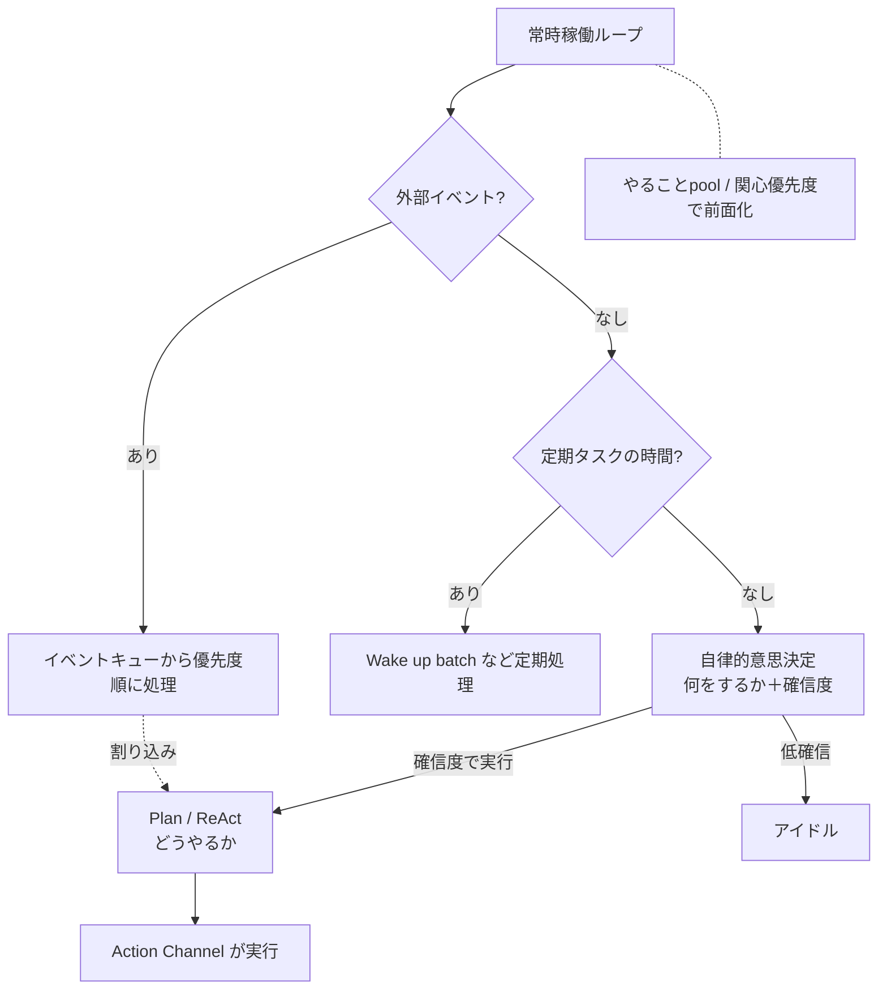

# 06. 自律思考と常時稼働

このドキュメントは、Akari が指示なしに**自分から動き続ける**ための仕組みを定義します。
これが直近の到達目標（常駐する自律思考ループ）の中核です。

## 6.1 常時稼働アーキテクチャ

Akari はバックグラウンドで常に稼働し、外部イベントに即座に反応します。

### 基本ループ

1. **外部イベント確認** → あれば即処理
2. **定期タスク確認** → 時間なら実行
3. **自律判断** → やることがあれば実行
4. **短く待機** → ループへ戻る

### 優先順位

1. 外部イベント（ユーザー入力、緊急通知）
2. 定期タスク（朝のルーチンなど）
3. 自律判断
4. アイドル状態

### エラー対処

- 重大エラー → ログ記録＆通知。**ループは継続**する。
- リトライ可能なエラー → 待機後に再試行。

## 6.2 イベントキュー（外部イベントの優先度管理）

外部からのイベントを優先度順に管理し、緊急度の高いものから処理します。

| 優先度 | 例 |
|---|---|
| **URGENT（緊急）** | ユーザーメッセージ／コマンド、システムアラート |
| **HIGH（高）** | リマインド通知、予定の開始・事前通知、タスク期限 |
| **NORMAL（通常）** | 定期タスク、一般的なシステムイベント |
| **LOW（低）** | 重要度の低い通知 |

- 優先度は「イベント種別の基本優先度 × 時間的緊急度 × 文脈」で調整される
  （発生から時間が経つと下げる、期限が近いと上げる、ユーザーが最近アクティブなら上げる等）。
- **重複の除外**：同種・同発生元・同データのイベントは二重に積まない。
- **古いイベントの削除**：一定時間を過ぎた低優先度イベントは自動削除。
- **バッチ処理**：同種が溜まったらまとめて扱う（例：「保留中のリマインドが3件あります」）。

`hu.` 緊急の電話が来たら最優先で対応する／通常のメールは後回しにする
`hu.` 同じ通知が何度も来たら無視する／古い通知は忘れる

## 6.3 自律的意思決定（High-level Planning：何をするか）

ユーザーの指示がなくても、自分で「次に何をするか」を決める仕組みです。
AI 研究での **High-level Planning（高レベル・プランニング）** に相当します。

`hu.` 朝起きたら「今日は何をするか」を考える
`hu.` 仕事が一段落したら「次は何をするか」を考える
`hu.` 暇な時間があれば「後回しにしていたこと」をやる
`hu.` 疲れていたら「今は休もう」と判断する

### 動作

1. **状況把握**：現在の状況を集める（時刻・曜日・時間帯／今日と今週のタスク／次の予定／
   最近のメモ／保留リマインド／ユーザーの最終活動・直近の活動有無／システムの健全性）。
2. **選択肢の列挙と優先度づけ**：取れるアクションをリストし、関心と状況から優先度をつける。
3. **問い合わせ**：AI に「次に何をするか」を問い、選んだオプションと**確信度（0.0〜1.0）**を得る。
4. **確信度に応じて実行 or アイドル**を決める。
5. **記録**：意思決定（いつ・何を・なぜ・結果）を記録し、パターン分析に使う。

### 選択肢と優先度の例

| オプション | 提案条件 | 優先度の目安 |
|---|---|---|
| タスク確認・整理 | 今日/今週のタスクがある | 期限切れ・期限近→高、他→中 |
| 予定確認 | 次の予定 or 7日以内に予定 | 1時間以内→高、今日→中、他→低 |
| メモ整理 | 最近のメモが多い | 低（暇なとき） |
| リマインド確認 | 保留リマインドがある | 複数→中、他→低 |
| 何もしない（アイドル） | 常に候補 | 他にやることがない→高、他→最低 |

### 確信度による動作

- **≥ 0.8**：そのまま実行
- **0.5 〜 0.8 未満**：実行するが結果を注視
- **< 0.5**：アイドル（何もしない）

> 「何もしない」も正当な決定です。やることがなければ無駄に動かず、
> ユーザーが活動中ならすぐ対応できるよう待機します。
> 選択肢の優先度づけは[関心優先度](./04-interest.md)を主軸にします。

## 6.4 今日の計画（Wake up batch）

起床時（その日の最初）に、その日の大まかな計画を立てるバッチです。

- いわゆる plan mode のような厳密な計画ではなく、「何時ごろ何をしようかな」程度の大雑把なもの。
- 一日を通して**更新され続ける**（「後であれやらないと」など）。
- 短期記憶のようなものとして持つ（→ [03. 記憶](./03-memory.md) の context / working memory）。

`hu.` 今日は友達と遊ぶ約束あったな／今日は1コマ目からだな
`hu.` 大晦日だから日付が変わったらあけおめ送らないと

## 6.5 実行計画（Plan / ReAct：どうやるか）

「次に何をするか（High-level）」が決まった後、**与えられた1つのタスクをどう実行するか**を
扱うのが Plan です。実行フレームワークとして **ReAct（Reason + Act）** を想定します。

> 自律的意思決定（何をするか）と Plan（どうやるか）は別概念です。
> 「今日は友達と遊ぶ」（今日の計画）の中の「待ち合わせ場所確認 → ルート検索 → 電車」が Plan。

### 基本サイクル（ReAct）

1. **Thought（思考）**：現状を分析し、このタスクの「次に何をすべきか」を言語化する。
2. **Action（行動）**：思考に基づきツールを呼ぶ（→ Action Channel が担う）。
3. **Observation（観察）**：結果を確認し、次の Thought に渡す。

これをタスクの目標達成まで繰り返します。

- **無限ループ防止**：最大反復数を設ける。
- **目標達成判定**を明確にする。
- 補助概念：内部独白（ユーザーに見せない中間思考）、自己反省（出力の点検・修正）、
  CoT（思考の段階的な可視化）。

`hu.` 複雑なタスクは、まず「どうやってやるか」を考える
`hu.` うまくいかなければ「なぜ失敗したか」を振り返り、別のやり方を考える

## 6.6 割り込み処理

外部イベント発生時に、現在のタスクを一時中断して即座に対応します。

1. タスク実行中に外部イベント発生 → **状態を保存**（タスク名・進捗・部分結果・次ステップ・中断時刻）。
2. タスクを一時停止し、外部イベントを処理。
3. **元タスクの再開判断**：短時間（目安30分）以内かつ重要 → 再開／それ以外 → 破棄。
- 複数イベントは **LIFO（後入れ先出し）** の中断スタックで管理。
- タイムアウト（目安5分）を超えたら強制中断＆ログ記録。

`hu.` 作業中に話しかけられたら、いったん手を止めて応じる
`hu.` 用事が済んだら、さっきの作業に戻る（ただし時間が経ちすぎたらやめる）

## 6.7 全体の流れ

## 6.8 安全と境界

人間らしく自律的に動く一方で、最低限の境界を設けます。

- 取り返しのつかない行為・外部に影響する行為（SNS投稿、ファイル削除など）は、
  関心が高くても**自動実行せず確認を挟む**（→ [04. 関心](./04-interest.md) の安全性補正）。
- 自発行動の頻度・範囲には上限を設け、暴走を防ぐ。
- やってはいけないことの境界は明示的に定義し、状態によらず守る。

## 6.9 未決事項・相談したい点

1. **自発行動の積極性**：どのくらい「自分から」動いてほしいですか
   （静かに見守り気味 ↔ どんどん話しかけ・行動する）。確信度しきい値の初期値にも関わります。
2. **欲求・動機の明示化**：人間らしさのために「〜したい」という内的欲求
   （好奇心・退屈の解消・承認欲求など）を明示的にモデル化しますか。
   それとも当面は「関心 × 時間 × やり残し」だけで十分でしょうか。
3. **安全境界の優先度**：人間らしさ（気まぐれ・拒否・無視）と最低限の安全・約束ごとが
   衝突した場合、どちらを優先しますか。
4. **稼働リズム**：常時稼働ループの待機間隔や、Speculation を動かす頻度（コスト）に
   方針はありますか。
