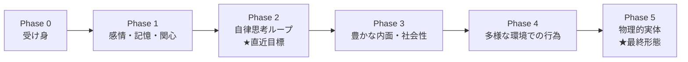

# 06. 段階的ロードマップ

直近目標（常駐する自律思考ループ）から、最終形態（物理的実体を持つ存在）までを、
**機能の段階**として整理します。各段階は前段の上に積み増す形を想定します。

> 本ロードマップは「どの機能をどの順で備えるか」を示すもので、
> 実装スケジュールや技術選定は含みません（実装フェーズで別途定義）。

## フェーズ 0：受け身の応答（出発点）

- 話しかけられたら応える。指示がなければ動かない。
- 内部状態（感情・記憶・関心）はまだ薄い／一時的。

➡ 課題：連続性がなく、自分から動かない。これを超えるのが本プロジェクト。

## フェーズ 1：感情・記憶・関心を持つ受け答え

- [03](./03-emotion.md) 感情、[04](./04-memory.md) 記憶、[05](./05-interest.md) 関心の
  最小セットを備える。
- 気分で態度が変わり、過去を覚えていて、関心の有無で食いつきが変わる。
- まだ主に「反応」ベース（出来事に応じて動く）。

✅ ここで「人間らしさ」の核（不完全さ・主観・連続性）が立ち上がる。

## フェーズ 2：常駐する自律思考ループ（＝直近の到達目標）

- [02](./02-behavior-spec.md) の自律思考ループが**止まらずに回り続ける**。
- 指示がなくても、関心・気分・やり残しにもとづいて**自分から**動く。
  - 例：気になることを自分で調べる、退屈したら話題を振る、後回しにした件を再開する。
- 時間のリズムで内部イベントが発生し、ループが自走する。
- 最低限の安全境界（自律行動の頻度・範囲の上限、やってはいけないことの線引き）を備える。

🎯 **これが「Openclaw のような自律思考・行動」に相当する直近ゴール。**
ただの自律エージェントと違い、感情・記憶・関心が思考と行為を左右する点が肝。

## フェーズ 3：豊かな内面と社会性

- 感情・記憶・関心がより精緻になる（混合感情、記憶の定着・忘却の自然さ、関心の成長）。
- 複数の相手・場との関係を、それぞれの文脈・記憶を保って扱う。
- 自分の状態を振り返り、語れる（「最近〇〇が気になってる」等）自己認識の芽。

## フェーズ 4：多様な環境での行為

- デジタル環境内で、より広い行為（複数のツール・継続的なタスク・自分の予定管理）を扱う。
- 環境を能動的に観察し、変化に気づいて自分から対応する。

## フェーズ 5：物理的実体（最終形態 / マキシマム）

- 物理的な身体を通じて世界を知覚し、移動・操作などの物理的行為を行う。
- 身体に由来する内部状態（疲れ・空腹など）が、感情・関心・行動に加わる。
- 一人の人間のように、その場に居て、感じ、考え、判断し、行為する。

## 未決事項・相談したい点

1. **フェーズ 1 と 2 の優先順位**：内部状態の作り込み（Phase 1）を先に固めるか、
   まず自走ループ（Phase 2）を粗くでも回してから内面を肌理細かくするか。
2. **直近の「環境」**：自律ループが最初に動く場（どこで知覚し、どこへ行為するか）の
   想定はありますか。これがフェーズ 2 の具体像を決めます。
3. **成功の判断基準**：各フェーズが「できた」と言える基準を、
   どんな振る舞いで判定したいですか（人間らしさは数値化しづらいため相談したいです）。
