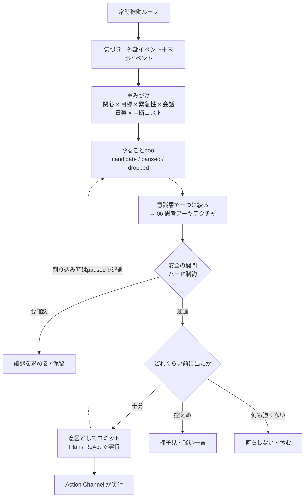

# 07. 自律思考と常時稼働

このドキュメントは、Akari が指示なしに**自分から動き続ける**ための仕組みを定義します。
これが直近の到達目標（常駐する自律思考ループ）の中核です。

> **既存仕様からの変更点（要レビュー）**
> 既存仕様書には「自律的意思決定」「イベントキュー」「割り込み処理」が
> それぞれ独立した機構として書かれていますが、優先度の付け方・しきい値・
> 再開ルールが機械的で、しかも「[関心優先度](./04-interest.md)を主軸に決める」という
> 中核方針や、仕様メモの TODO「全ての優先度を関心に基づき決定する」と二重化していました。
> ここでは **優先度・注意・作業再開をすべて関心優先度に一本化**し、固定的な
> マジックナンバー（30分・5分・確信度0.8 等）や Deactivated な Seikatsu への依存を
> 外す方向で書き直しています。変更の妥当性はレビューで判断してください。

## 7.1 常時稼働アーキテクチャ

Akari はバックグラウンドで常に稼働し、外部にも内部にも反応し続けます。

### 基本ループ

1. **気づき（知覚）**：外部イベント（メッセージ・通知・時刻）と内部イベント
   （思いつき・気分の変化・やり残しの想起）を受け取る。
2. **関心優先度づけ**：いま注意を向けるべき候補を[関心優先度](./04-interest.md)で選ぶ。
3. **意思決定**：動くか・何をするか・あえて何もしないかを決める（→ 6.2）。
4. **行為**：[Action Channel](./06-architecture.md) などを通じて実行、または発話。
5. **短く待機**してループへ戻る。

### 止まらないこと

- 誰も話しかけていなくても、時間経過・思いつき・やり残しが内部イベントになり、ループが進む。
- **重大エラーでもループは止めない**（ログ＋通知して継続）。リトライ可能なら待機後に再試行。

### 反応の速さは「関心 × 緊急性 × 中断コスト」で決まる

外部イベントだから必ず最優先、ではありません。人間と同じく、
**いま向き合っていることの重さ**と**割り込みの重要さ**を秤にかけます。

`hu.` 集中している作業中は、軽い通知なら後で見る
`hu.` 名前を呼ばれたら手を止めて応じる
`hu.` 緊急の連絡は何をしていても最優先で対応する

> これにより、既存仕様の「外部イベントは常にURGENT」という固定優先度を、
> 関心優先度の[中断コスト・会話責務・緊急性](./04-interest.md)の補正に統合します。

## 7.2 自律的意思決定（何をするか）

ユーザーの指示がなくても「次に何をするか」を自分で決める仕組みです。
AI 研究での **High-level Planning（高レベル・プランニング）** に相当します。

`hu.` 朝起きたら「今日は何をするか」を考える
`hu.` 一段落したら「次は何をするか」を考える
`hu.` 暇なら「後回しにしていたこと」や「気になっていること」をやる
`hu.` 疲れていたら「今は休もう」と判断する

### 動作

1. **状況把握**：いまの状況を集める。
   時刻・時間帯／いまの気分（[感情](./02-emotion.md)）／**いま抱えている意図**
   （[目標と意図](./05-goal.md)）／やることpool の候補と関心度／
   進行中・保留中の作業／予定・やり残し／相手が最近やり取りしていたか／システムの健全性。
2. **候補を重みづけする**：取りうる行動を、**関心・目標・緊急性・会話責務・中断コスト**を
   合わせて重みづけする（→ [04. 関心](./04-interest.md) 4.5）。
3. **安全の関門を通す**：取り返しのつかない行為・外部影響のある行為は、
   重みに関わらずここで**確認へ回す**（→ 7.7）。
4. **選ぶ**：最も前面化した候補を選ぶ。**何も強く前に出てこなければ「何もしない」**。

> **すでに意図を持っている場合**：新しく選び直すより、**いま抱えている意図を続ける**のが
> 既定の動きです。意図は移ろう関心に抗って持続します（→ [05](./05-goal.md)）。
> 割り込むには、関心・緊急性が意図の持続力を上回る必要があります。

### 取りうる行動（実務に限らない）

> **変更点**：既存仕様の選択肢は「タスク確認・予定確認・メモ整理・リマインド確認」と
> 実務アシスタント寄りで、かつ Deactivated な Seikatsu に依存していました。
> ビジョン（人間らしさ・主体性）に合わせ、関心・関係・好奇心・休息も含む形に広げます。

| 行動の例 | 前に出やすい状況 |
|---|---|
| **いま抱えている意図を進める** | 意図があり、それを覆すほどの割り込みがない（**既定**） |
| 気になっていることを調べる・深める | 関心の高い話題があり、急ぎがない |
| 自分から話しかける・近況を尋ねる | 退屈、相手としばらく接していない、共有したい思いつきがある |
| やり残し（保留中の候補）を再開する | 関心が再び高まった、関連する文脈が出てきた |
| 予定・約束を気にかける／声をかける | 時間が近い、相手が待っている |
| 何もしない・休む | 急ぎがなく、強く気になることもない／疲れている |

### 「確信度」の扱い（しきい値を撤廃）

> **変更点**：既存仕様の「確信度 ≥0.8で実行 / <0.5でアイドル」という固定しきい値は、
> 人間の意思決定らしくないため**ハードなゲートを廃止**します。

確信は 0/1 のスイッチではなく、**どれくらい思い切って動くかの度合い**として扱います。

- 確信が高い → そのまま動く。
- 中くらい → 動くが、控えめに・様子を見ながら（軽い一言、結果を注視）。
- 低い → 前に出さず、やることpool に保留しておく（関連文脈が来たら再評価）。

`hu.` 確信があれば即やる／自信がなければ「一応聞いてみる」程度にとどめる／微妙なら胸にしまっておく

### 振り返り

意思決定（いつ・何を・なぜ選び・どうなったか）は記憶（[Kiseki](./03-memory.md)）に残し、
あとで「最近こういう判断をしがちだな」と自分の傾向を振り返れるようにします。

## 7.3 今日の計画（Wake up batch）

起床時（その日の最初）に、その日の大まかな計画を立てます。

- 厳密な計画ではなく「何時ごろ何をしようかな」程度の大雑把なもの。
- 一日を通して**更新され続ける**（「後であれやらないと」など）。
- 短期記憶のようなものとして持つ（→ [03. 記憶](./03-memory.md) の context / working memory）。

`hu.` 今日は友達と遊ぶ約束あったな／今日は1コマ目からだな
`hu.` 大晦日だから日付が変わったらあけおめ送らないと

## 7.4 実行計画（Plan / ReAct：どうやるか）

「次に何をするか（6.2）」が決まった後、**与えられた1つのタスクをどう実行するか**を
扱うのが Plan です。実行フレームワークとして **ReAct（Reason + Act）** を想定します。

> 自律的意思決定（何をするか）と Plan（どうやるか）は別概念です。
> 「今日は友達と遊ぶ」（今日の計画）の中の「待ち合わせ場所確認 → ルート検索 → 電車」が Plan。

### 基本サイクル（ReAct）

1. **Thought（思考）**：現状を分析し、このタスクの「次に何をすべきか」を言語化する。
2. **Action（行動）**：思考に基づきツールを呼ぶ（→ Action Channel が担う）。
3. **Observation（観察）**：結果を確認し、次の Thought に渡す。

これをタスクの目標達成まで繰り返します。

- **無限ループ防止**：最大反復数を設ける。
- **目標達成判定**を明確にする。
- 補助概念：内部独白（ユーザーに見せない中間思考）、自己反省（出力の点検・修正）、
  CoT（思考の段階的な可視化）。

`hu.` 複雑なタスクは、まず「どうやってやるか」を考える
`hu.` うまくいかなければ「なぜ失敗したか」を振り返り、別のやり方を考える

## 7.5 作業の中断と再開（関心で扱う）

> **変更点**：既存仕様の「割り込み処理」は、状態保存・LIFOスタック・
> 「30分以内かつ重要なら再開／5分でタイムアウト」という固定ルールでした。
> これらのマジックナンバーは人間らしくなく、やることpool・関心優先度と二重化するため、
> **再開可否も関心で扱う**形に統合します。

- 何かに割り込まれたら、いまの作業の進み具合（どこまでやったか・次の一歩）を覚えておき、
  その作業を[やることpool](./06-architecture.md) に **`paused`** として置く。
- 割り込みに対応する。
- 元の作業に戻るかは、固定の時間ではなく**そのときの関心と文脈**で決まる。
  - まだ気になっている／関連する話が出た → 自然に再開する。
  - 関心が薄れた → そのまま `dropped` になって消えていく。

`hu.` 作業中に話しかけられたら、いったん手を止めて応じる
`hu.` 用事が済んで、まだ気になっていれば作業に戻る
`hu.` 戻るころには「もういいや」となって、やめてしまうこともある

## 7.6 全体の流れ

## 7.7 安全と境界（ハード制約）

人間らしく自律的に動く一方で、**安全だけは他のすべてに優先する制約**として扱います
（→ [01. 原則9](./01-vision.md)）。

- 取り返しのつかない行為・外部に影響する行為（SNS投稿、ファイル削除、送金、外部への送信など）は、
  関心・感情がどれだけ高ぶっても**自動実行せず確認を挟む**。
- ただし**会話中の発話は関門を通します**。相手には受け取る用意があるので、
  一言ごとに確認していては会話が成立しません。分かれ目は「人目に触れるか」ではなく
  **受け手に受け取る用意があるか**です（→ [09. 9.4](./09-capabilities.md)）。
- これは重みづけの一要素（補正）**ではなく、重みづけの後に立つ関門**として実装する。
  関心が極端に高ければ通ってしまう、という設計にはしない。
- 関門が見るのは**どこまで届くか**だけ。**何を言うか**は禁止事項と
  [機密ロック](./03-memory.md)、**言いすぎ**は[自制心](#78-自発行動の抑制自制心とシステムリミット)が見る。
- 自発行動の頻度・範囲の歯止めは、まず自制心が担う
  （→ [7.8](#78-自発行動の抑制自制心とシステムリミット)）。機械的な上限は最後の砦。
- やってはいけないことの境界は明示的に定義し、感情・気分・関心の状態によらず守る。
- ここは**人間らしさより安全を優先する**数少ない領域として明確に区別する。
- 安全に関わる**速い回避反応**（危ういと感じたら手を止める）は、
  感情の直接経路（→ [02. 感情](./02-emotion.md) 2.1）としても働く。

## 7.8 自発行動の抑制（自制心とシステムリミット）

自分から動く存在には、どこかで止まる仕組みが要ります。
止め方は**二段構え**にし、**通常は自制心に任せます**。

### なぜ二段なのか

回数で縛るのがいちばん簡単ですが、それは専用ルールであって
[原則8](./01-vision.md)に反します。「1時間に3回まで」で動く存在は、
止まる理由が自分の中にないので、人間らしさから遠ざかります。

かといって自制心だけでは、不具合や思わぬループのときに歯止めがありません。

そこで、**内側から効く自制心**を通常の抑制とし、その外側に
**最後の砦としてのシステムリミット**を置きます。

| | マインドリミット（自制心） | システムリミット |
|---|---|---|
| 何を防ぐか | やりすぎ・うるささ | 暴走 |
| どう効くか | 関心が湧かなくなる（結果として動かない） | 行為そのものが止められる |
| 通常運転では | **常に効いている** | **触れない** |
| 人格ごとに | 変わる | 変わらない |
| 作法 | 基盤の仕組みから創発させる | 専用ルール（最小限） |

### マインドリミット：自制心

> **現状の穴（ここで埋めます）**：これまでの抑制は
> [飽き](./04-interest.md)も[手応えのなさ](./04-interest.md)も、
> すべて**対象ごと**にしか効きません。ある話題に飽きても**別の話題に移るだけ**で、
> 全体の活動量は落ちないままでした。
> 自制心を実体のあるものにするには、全体に効くものが要ります。

自制心は、次の三つが重なって生まれます。

#### 疲れ（全体に効く）

- **動くことでも、考えることでも溜まる**。積もるほど、**何に対しても関心が湧きにくくなる**。
- 休むと戻る。眠れば（→ 7.3 の一日の区切り）しっかり戻る。
- これは感情ではありませんが、気分と同じく**関心全体を左右する**内部状態です
  （→ [04. 4.4](./04-interest.md)）。
- 疲れやすさ・戻りやすさは**人格ごとの調整パラメータ**
  （→ [01. 原則1](./01-vision.md) / [12.8](./12-persona.md)）。
  疲れ知らずの人格も、すぐ消耗する人格も作れます。

##### 何が疲れを生むのか：意識に上がった量

行為の回数だけではありません。**意識に上がったもの**が疲れを生みます
（→ [06. 6.4](./06-architecture.md) の意識層）。

- **意識層を通った分だけ疲れる**。迷う、悩む、突き合わせて矛盾を解く——
  どれも意識層の仕事で、どれも疲れます。
- **潜在意識で並列に動いている分は、ほとんど疲れを生みません。**
  裏でいくつも走っていること自体は消耗になりません。

`hu.` 何もしていないのに、考えごとばかりしていて疲れた
`hu.` 決めることが多い日は、体を動かしていなくても消耗する

> **慣れると疲れなくなる**。これはこのモデルから自然に出てくる性質です。
> 繰り返して安定した手順は意識層から潜在意識へ降りるので
> （→ [06. 6.6](./06-architecture.md)）、**同じことをしても、慣れる前は疲れ、
> 慣れた後は疲れません**。逆に、失敗して意識層に戻された手順はまた疲れを生みます。
>
> 疲れを「行為の回数」で数えていたら、この性質は出ませんでした。

これで [7.2](#72-自律的意思決定何をするか) の選択肢にある「疲れている」が
裏づけを得ます。これまでは言及だけがあって、疲れという状態がどこにもありませんでした。

`hu.` 根を詰めたあとは、何を見ても気が乗らない
`hu.` 一晩寝たら、また気になり始めた

#### 飽き（対象ごとに効く）

繰り返し触れた対象は新奇さが薄れ、手応えがなければ関心が減衰する（既存の仕組み。
→ [04. 4.3](./04-interest.md), [4.4](./04-interest.md)）。
ひとつのことに延々と張り付くのを防ぎます。

#### 遠慮（相手ごとに効く）

- **さっき働きかけたばかりの相手には、しばらく控える**。
- 相手が取り込み中なら、些細な用では割り込まない。

自分から話しかけることは最も目につく自発行動なので、うるささはここに出ます。
遠慮はそれを内側から抑えます。遠慮の強さも人格ごとに変わります。

`hu.` さっきも話しかけたばかりだから、今はやめておく
`hu.` 言いたいことはあるが、相手が忙しそうなので後にする

### システムリミット：最後の砦

- 一定時間あたりの行為の数などに、機械的な上限を置きます。
- **通常運転では到達しません。** 自制心が効いていれば、その手前で止まります。
- **到達したら記録し、マインド側の調整不足のサインとして扱います。**
  システムリミットが日常的に発動している状態は、うまく動いている証拠ではなく、
  自制心が弱すぎるという**設計のバグの兆候**です。

### 安全の関門との違い

[7.7](#77-安全と境界ハード制約) の安全とは別物です。混同しないでください。

| | 安全の関門 | システムリミット |
|---|---|---|
| 止めるもの | **やってはいけないこと** | **やりすぎ** |
| 判断の基準 | 行為の種類と影響の範囲 | 量 |
| 通常運転で | 頻繁に働く（確認を挟む） | 働かない |

## 7.9 決定事項（レビュー反映済み）

- **自発行動の抑制は二段構え**。通常は自制心（マインドリミット）に任せ、
  システムリミットは最後の砦として置く（→ [7.8](#78-自発行動の抑制自制心とシステムリミット)）。
- **疲れを内部状態として持つ**。全体に効く唯一の抑制で、これが無いと
  「対象を乗り換え続ける」だけになり活動量が落ちない。
- **疲れは意識に上がった量で溜まる**（行為の回数ではない）。考えるだけでも疲れ、
  慣れて潜在意識に降りた手順は疲れを生まなくなる。
- **システムリミットへの到達は異常**として扱い、記録して自制心の調整に使う。

## 7.10 未決事項・相談したい点

**自発性・疲れやすさ・回復の速さ・遠慮の強さ・意図の割り込みやすさ**は、
[12. 人格パラメータ](./12-persona.md) の調整軸として外に出しました。
体感的な「積極性」はこれらの合成で決まり、単一のつまみではありません。

> **人格で動かせないもの**：システムリミットと安全の関門は人格によらず固定です
> （→ [12.10](./12-persona.md)）。自制心が緩い人格ほどシステムリミットが必要になりますが、
> それに日常的に触れる設定は[7.8](#78-自発行動の抑制自制心とシステムリミット)のとおり
> 「設定が悪い」と扱います。

1. **外部イベントへの最低応答保証**：人間らしさで「無視」も許すと、ユーザーのメッセージに
   反応しないことが起こりえます。「ユーザーからの直接の呼びかけには必ず一定時間内に
   何か返す」といった**最低保証**は設けますか。
   設けるなら、その下限は**人格で動かせないもの**として扱います（→ [12.10](./12-persona.md)）。
2. **欲求・動機の明示化**：休息欲は疲れとして入りましたが、好奇心・承認欲求などを
   さらに明示的にモデル化しますか。それとも当面はこれで十分でしょうか。
