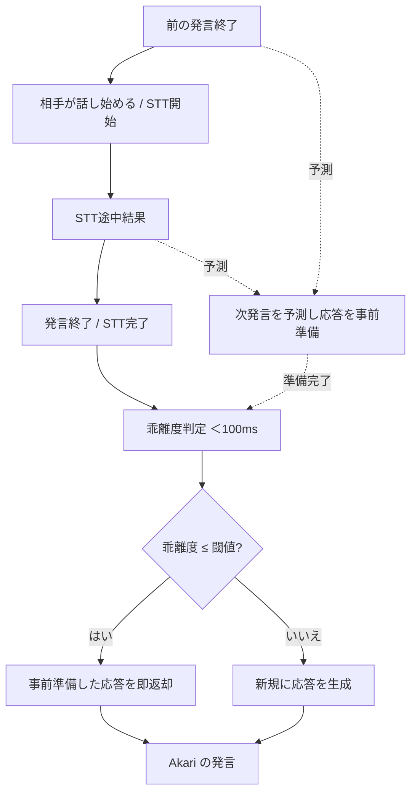

# 07. 会話と予測

このドキュメントは、Akari の会話のリアルタイム性に関わる仕様を定義します。
会話そのものは [Interaction Channel](./05-architecture.md) が担います。

## 7.1 予測機構

ユーザーの次の発言を予測し、予測が当たっていれば**先に用意しておいた応答**を返すことで、
会話のリアルタイム性を高める仕組みです。

`hu.` 相手の話の流れから「次にこう言いそうだな」と予測できる
`hu.` 「ありがとう」と言われたら「どういたしまして」と返す準備をしている
`hu.` 会議で「次の議題に」と言われる前に、次の資料を開いておく
`hu.` よく話す相手とは、相手の癖や話し方のパターンを理解している
`hu.` 質問の途中で「あ、○○のことですね」と先回りして答えることがある

### 動作

- 会話のコンテキストから次の発言を予測し、応答を事前準備（LLM・TTS まで済ませておく）。
- 実際の発言が来たら、予測との**乖離度**を計算（→ 7.2）。
- 乖離度が閾値以下 → 事前準備した応答を即座に返す。
- 乖離度が閾値を超える → 通常フローで新規に応答を生成する。

### 予測のタイミング

- 誰かの発言が終わった直後（まだ続くか、次の話者が話すかの予測）。
- 特定パターン（挨拶など）を検出したとき。
- 音声認識（STT）の途中結果が返ってきたとき。
  - STT が完了するまでは返信しない。完了後に乖離度判定をして返す。

### 予測戦略

- **パターンマッチング**：頻出する会話パターンの検出。
- **コンテキスト推論**：会話履歴・ユーザー属性からの推測。

### 予測中の副作用の制御（重要）

予測はあくまで「準備」なので、確定するまで外界・長期記憶に影響を残しません。

- 予測結果は**短期記憶に止め、伝播させない**。長期記憶や外部ツールの **Update 系は実行しない**。
  - そもそも会話中は外部ツールの Update を走らせない（→ [Channel の責務](./05-architecture.md)）。
- 外部ツールの **Read は許可**（例：次の会議資料の準備）。
- **予想が裏切られると関心が起こり、優先度が上がる**（→ [04. 関心](./04-interest.md) /
  [02. 感情](./02-emotion.md) の驚き）。

## 7.2 乖離度判定

2つの文の意味的なズレ（乖離度）を、高速に判定します。

- 2文を入力すると乖離度が得られる。
- Cross-Encoder / NLI のような手法で、比較的高速に文の意味をとらえる。
- **否定・助詞の違いに注意**：
  - 「りんごが好き」→「りんごが好き**じゃない**」（否定で意味が反転）
  - 「りんご**が**好き」→「りんご**は**好き？」（助詞・疑問で意味が変わる）
  - これらが正しく「乖離あり」と判定されること。

## 7.3 ターンテイキング（誰がいつ話すか）

前の発言の後、次に話すのが Akari なのか相手なのかを判定する仕組みです。
（予測機構とは別に判定する。**現状は WIP / 未確定**）

`hu.` 相手がまだ話し続けそうなら、口を挟まず待つ
`hu.` 沈黙が続いたら、自分から話し始める
`hu.` 相づちと、話し始めの発言を使い分ける

## 7.4 全体の流れ

## 7.5 未決事項・相談したい点

1. **ターンテイキングの方針**：沈黙からどれくらいで Akari が話し始めるか、
   割り込み発話をどこまで許すか。人間らしさの肝なので方針を相談したいです。
2. **予測の使いどころ**：テキスト会話でも予測機構を使いますか、それとも主に音声会話向けですか。
3. **予測が外れたときの振る舞い**：先回りして外したときに、どう取り繕う／訂正するのが自然か。
