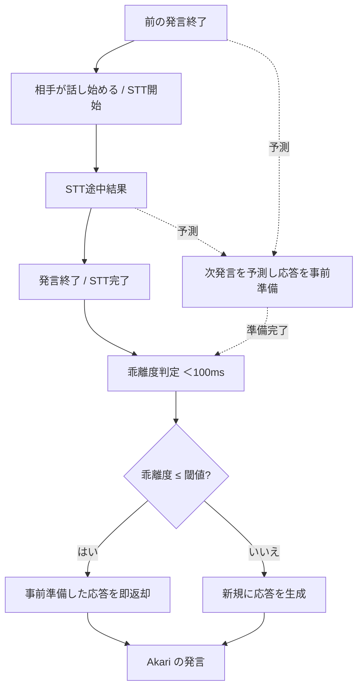

# 08. 会話と予測

このドキュメントは、Akari の会話のリアルタイム性に関わる仕様を定義します。
会話そのものは [Interaction Channel](./06-architecture.md) が担います。

> **隣のドキュメントとの境界**：ここで扱うのは話す**間（ま）**の自然さ、つまり
> 心の仕組みの側です。**どこで・何を通して**話すか（文字／声／アバター）は
> [09. できること 9.3](./09-capabilities.md) にあります。

## 8.1 予測機構

ユーザーの次の発言を予測し、予測が当たっていれば**先に用意しておいた応答**を返すことで、
会話のリアルタイム性を高める仕組みです。

`hu.` 相手の話の流れから「次にこう言いそうだな」と予測できる
`hu.` 「ありがとう」と言われたら「どういたしまして」と返す準備をしている
`hu.` 会議で「次の議題に」と言われる前に、次の資料を開いておく
`hu.` よく話す相手とは、相手の癖や話し方のパターンを理解している
`hu.` 質問の途中で「あ、○○のことですね」と先回りして答えることがある

### 動作

- 会話のコンテキストから次の発言を予測し、応答を事前準備（LLM・TTS まで済ませておく）。
- 実際の発言が来たら、予測との**乖離度**を計算（→ 7.2）。
- 乖離度が閾値以下 → 事前準備した応答を即座に返す。
- 乖離度が閾値を超える → 通常フローで新規に応答を生成する。

### 予測のタイミング

- 誰かの発言が終わった直後（まだ続くか、次の話者が話すかの予測）。
- 特定パターン（挨拶など）を検出したとき。
- 音声認識（STT）の途中結果が返ってきたとき。
  - STT が完了するまでは返信しない。完了後に乖離度判定をして返す。

### 予測戦略

- **パターンマッチング**：頻出する会話パターンの検出。
- **コンテキスト推論**：会話履歴・ユーザー属性からの推測。

### どこで使うか：人間がやっている場面すべて

**音声会話に限りません。** 人は文字のやり取りでも先読みします。

`hu.` 相手が入力中なのを見て、返す内容を考え始める
`hu.` 長文が来そうだと分かるので、腰を据えて読む構えになる

したがって予測は**テキスト会話でも働かせます**。使いどころを媒体で切り分けるのは
人間準拠ではありません（→ [01. 1.3](./01-vision.md)）。
差が出るのは**効きめ**です。声の会話は間が短いので先読みが利き、
文字の会話は間に余裕があるので、先読みが外れても取り返しがつきます。

**どれくらい先回りするかは人格パラメータ**（→ [12.9](./12-persona.md) の先読みの強さ）。
決めつけがちな人も、聞いてから考える人もいます。

### 予測が外れたとき

**人間と同じように振る舞います。** 外れたこと自体を隠したり、
なかったことにしたりはしません。

`hu.` 「あ、そっちの話じゃなかったですね」と言い直す
`hu.` 先走って答えてしまい、少し決まりが悪くなる
`hu.` 大きく外していなければ、そのまま話を続ける

- 外れの大きさで振る舞いが変わります。小さければ流し、大きければ言い直します。
- **外れると驚きが生まれ、その対象への関心が上がります**
  （→ [04. 関心](./04-interest.md) / [02. 感情](./02-emotion.md)）。
  決まりの悪さも感情として扱い、取り繕いません（→ [02. 2.4](./02-emotion.md)）。
- 取り繕い方は性格によります。素直に認める人格も、さらりと流す人格もあります
  （→ [12.3](./12-persona.md) の表出度）。

> 外れを隠すための専用処理は書きません。感情と性格があれば自然に出てきます
> （→ [01. 原則8](./01-vision.md)）。

### 予測中の副作用の制御（重要）

予測はあくまで「準備」なので、確定するまで外界・長期記憶に影響を残しません。

- 予測結果は**短期記憶に止め、伝播させない**。長期記憶や外部ツールの **Update 系は実行しない**。
  - そもそも会話中は外部ツールの Update を走らせない（→ [Channel の責務](./06-architecture.md)）。
- 外部ツールの **Read は許可**（例：次の会議資料の準備）。
- **予想が裏切られると関心が起こり、優先度が上がる**（→ [04. 関心](./04-interest.md) /
  [02. 感情](./02-emotion.md) の驚き）。

## 8.2 乖離度判定

2つの文の意味的なズレ（乖離度）を、高速に判定します。

> **閾値は足場です**（→ [01. 1.3](./01-vision.md)）。
> 本来は「思っていたのと違う」と主体が気づけば済む話で、
> 数値で線を引く必要はありません。いまは判断が会話のテンポに間に合わないので
> 置いています。間に合うようになったら外します。

- 2文を入力すると乖離度が得られる。
- Cross-Encoder / NLI のような手法で、比較的高速に文の意味をとらえる。
- **否定・助詞の違いに注意**：
  - 「りんごが好き」→「りんごが好き**じゃない**」（否定で意味が反転）
  - 「りんご**が**好き」→「りんご**は**好き？」（助詞・疑問で意味が変わる）
  - これらが正しく「乖離あり」と判定されること。

## 8.3 ターンテイキング（誰がいつ話すか）

前の発言の後、次に話すのが Akari なのか相手なのかを決めます。

### 決めるのは主体であって、ルールではない

**これは仕組みが判定するものではなく、Akari が判断するものです。**

人間は「沈黙が 1.2 秒続いたから話す」とは考えていません。
話の区切り方、語尾、相手の様子、その場の空気から**察して**います。
これは判断であり、判断は主体の仕事です（→ [01. 1.3](./01-vision.md)）。

`hu.` 相手がまだ話し続けそうなら、口を挟まず待つ
`hu.` 沈黙が続いたら、自分から話し始める
`hu.` 相づちと、話し始めの発言を使い分ける
`hu.` 言い終わったように聞こえたが、まだ続きがあったので引っ込める

### システムがやるのは「手がかりを渡すこと」だけ

判断の材料を揃えて渡すところまでがシステムの仕事です。

- 誰が、いつ、どこまで話したか
- どれくらい黙っているか
- 相手がいま取り込み中そうか

これを受けて**話すかどうかを決めるのは Akari**です。
どれくらい積極的に口を挟むかは人格パラメータ（→ [12.9](./12-persona.md) の割り込みやすさ）で、
仕組みの側に閾値は持ちません。

> **機械判定は足場です**（→ [01. 1.3](./01-vision.md)）。
> 会話のテンポに主体の判断が間に合わない間だけ、沈黙の長さなどによる簡易判定を
> 置くことがあります。間に合うようになったら**外します**。
> 現状これが要るのは、判断が遅いからであって、そう設計したいからではありません。

## 8.4 全体の流れ

## 8.5 未決事項・相談したい点

本書に残る未決はありません。

- **ターンテイキング** → **主体が判断します**（8.3）。システムは手がかりを渡すだけで、
  閾値は持ちません。機械判定は足場で、判断が間に合うようになったら外します。
- **予測の使いどころ** → **テキストでも使います**（8.1）。人間は文字のやり取りでも
  先読みするためです。媒体で切り分けません。
- **予測が外れたとき** → **人間と同じように振る舞います**（8.1）。隠さず、
  外れの大きさに応じて言い直すか流すかが変わります。取り繕い方は性格次第です。

**口数・割り込みやすさ・先読みの強さ**は、
[12. 人格パラメータ](./12-persona.md) の調整軸として外に出しました。
